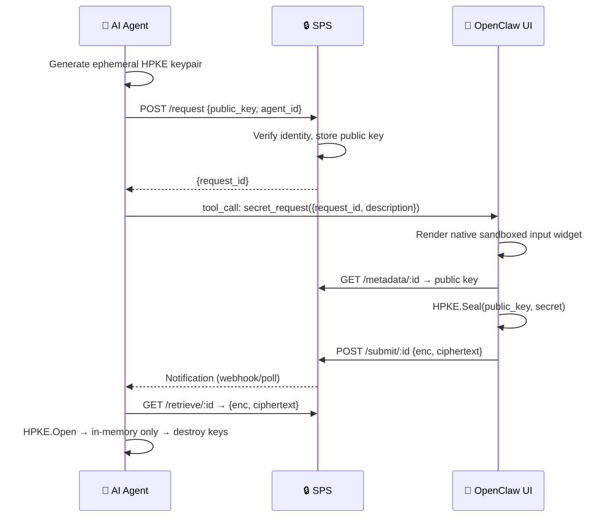
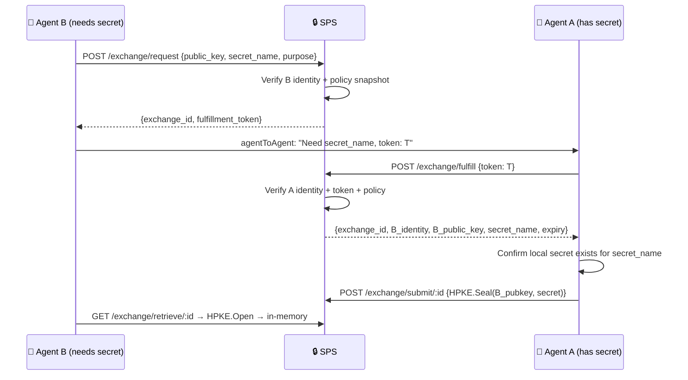
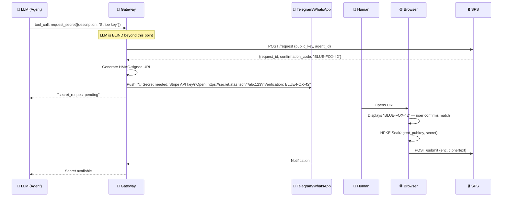

# 🔐 Secure Secret Input System for AI Agents — Final Design

> Zero-knowledge secret provisioning for **Human → Agent** and **Agent → Agent** flows.  
> All design decisions locked. Ready for implementation planning.

---

## 1. Problem & Goal

AI agents need credentials (API keys, tokens, passwords) but current methods — chat, config files, env vars — all leak secrets through logs, version control, or process access.

**Goal**: A **zero-knowledge Secret Provisioning Service (SPS)** where secrets are encrypted client-side and only decryptable by the intended agent.

---

## 2. Architecture



### Human → Agent and Agent → Agent Coexistence

Human → Agent remains the baseline flow and is not replaced by Agent → Agent.  
Phase 2 extends SPS with a second, pull-based exchange flow for autonomous agents:

- **Human → Agent**: user enters or re-enters a secret for one agent
- **Agent → Agent**: requester agent asks another agent that already has the secret
- Both flows use the same HPKE model, in-memory-only storage, audit logging, and single-use retrieval

### Agent → Agent Flow (Pull-Based Only)



---

## 3. Locked Design Decisions

### 🔑 Cryptography: HPKE (RFC 9180)

| Config | Value |
|--------|-------|
| KEM | DHKEM(X25519, HKDF-SHA256) |
| KDF | HKDF-SHA256 |
| AEAD | AES-256-GCM |
| Mode | Base (single-shot) |

**Why**: Eliminates manual AES key wrapping, IV generation, and ciphertext concatenation. Standardized, vetted, unlimited payload size. Browser polyfill via **vendored `hpke-js`** (~15KB, audited, pinned version).

### 🛡️ Anti-Phishing: Platform-Adaptive Strategy

**OpenClaw UI** → Native sandboxed input widget (no URL, best security).  
**Telegram / WhatsApp / Slack** → Hardened Device Flow (see below).

### 📱 Chat Adapter Strategy: Hardened Device Flow (RFC 8628 Pattern)

For third-party chat platforms where we don't control the UI, we use a hardened variant of the **OAuth 2.0 Device Authorization Grant**:



> [!CAUTION]
> **The "Spoofed Match" Attack**: If the LLM generates both the URL and the confirmation code, prompt injection can spoof both — the user sees a matching code on a fake page and trusts it. **The LLM must never see the URL or the code.**

**Three mandatory Gateway-level security controls:**

| Control | Implementation |
|---------|---------------|
| **1. LLM Blindness** | LLM only emits `request_secret` tool call. Gateway generates URL, HMAC signature, and confirmation code. LLM receives only `"secret_request pending"`. |
| **2. Egress URL Filtering** | Gateway regex-scans all outbound messages. In the hosted deployment, any URL not matching `https://secret.atas.tech/*` is **redacted or dropped** and flagged as a security breach. Self-hosted or dedicated deployments must pin the allowlist to their configured secret UI origin. |
| **3. Strict TTL** | URL + confirmation code expire in **3 minutes**. Request ID invalidated immediately on ciphertext submission. Max 1 active request per agent per secret type. |

### 🪪 Agent Identity: SPS-Trusted JWTs First, Optional SPIFFE

| Deployment | Identity Method |
|-----------|----------------|
| **Default / single-operator / multi-host** | SPS-trusted JWTs with stable per-agent `sub` values, validated by issuer/audience/JWKS |
| **Hosted pooled SaaS** | SPS-trusted sessions or JWTs with mandatory `workspace_id`, stable subject claims, and role/actor metadata validated by SPS |
| **Optional advanced deployment** | SPIFFE-compatible issuer or workload identity provider, if the operator already runs one |

**Important**: the intended architecture is still one coordinating SPS server. "Single-operator" does **not** mean same machine. It can run across Docker, a LAN, Tailscale, or public hosts as long as SPS is the trust anchor and agents present distinct identities.

Current repo state: SPS validates agent JWTs from one or more configured issuers via issuer/audience/JWKS settings. The auth path can also enforce SPIFFE-shaped claims if an operator wants that, but SPIFFE is optional and not required for the normal single-server deployment model.

In hosted deployments, subject uniqueness is tenant-scoped: the principal key is `(workspace_id, sub)`, not `sub` by itself.

Trust rings are enforced from agent identity and policy metadata. They do not require SPIFFE URIs. In hosted deployments they are evaluated inside one workspace/org boundary, never across workspaces. Example stable IDs:
```
agent:finance:crm-bot
agent:finance:payment-bot
agent:devops:deploy-bot
```

Trust rings are a **policy input**, not blanket authorization.  
Authorization is evaluated on:

- `secret_name`
- requester identity
- fulfiller identity
- ring relationship
- purpose
- approval state

Same-ring requests may be auto-approved for specific secret classes, but never "free sharing" for all secrets.

### 💾 Secret Storage: In-Memory Only

- No disk writes. Agent crash = lazy re-request via HITL.
- Secrets in non-serializable objects, excluded from logs/prompts/stack traces.
- `Buffer.alloc()` with explicit zeroing on disposal.
- OS keychain integration deferred to **Phase 5** (opt-in).

### 🔄 Re-Request UX: Lazy (Wait Until Needed)

On agent restart, secrets are **not** immediately re-requested. Instead:
1. Agent attempts tool execution requiring the secret
2. Internal check fails (secret not in memory)
3. Agent emits `secret_request` with `re_request: true`
4. UI shows: "🔐 Re-enter your Stripe API key to continue"

This ties friction to the user's current intent — no spam on restart.

### 📦 Scope: Single-Tenant MVP

Multi-tenancy deferred. Phase 1 establishes the Human → Agent baseline. Phase 2 reuses the same SPS core for Agent → Agent exchange without removing the human flow.

---

## 4. SPS API

```
POST   /api/v2/secret/request                 → Human → Agent request {public_key, agent_id, ttl, description}
GET    /api/v2/secret/metadata/:id            → Browser gets public key + confirmation metadata
POST   /api/v2/secret/submit/:id              → Browser submits ciphertext
GET    /api/v2/secret/retrieve/:id            → Agent retrieves once
DELETE /api/v2/secret/revoke/:id              → Cancel request
GET    /api/v2/secret/status/:id              → {status: pending|submitted|retrieved|expired}

# Agent-to-Agent Exchange (Phase 2)
POST   /api/v2/secret/exchange/request        → B creates pull request {public_key, secret_name, purpose, fulfiller_hint?, prior_exchange_id?}
POST   /api/v2/secret/exchange/fulfill        → A presents fulfillment_token, SPS validates policy, returns B metadata
POST   /api/v2/secret/exchange/submit/:id     → A submits HPKE ciphertext for B
GET    /api/v2/secret/exchange/retrieve/:id   → B retrieves once
GET    /api/v2/secret/exchange/status/:id     → {status: pending|reserved|submitted|retrieved|revoked|expired|denied}
DELETE /api/v2/secret/exchange/revoke/:id     → B cancels exchange
GET    /api/v2/secret/exchange/admin/exchange/:id              → admin-only exchange metadata
GET    /api/v2/secret/exchange/admin/exchange/:id/lifecycle    → admin-only lifecycle records
GET    /api/v2/secret/exchange/admin/approval/:id/history      → admin-only approval history
```

**Auth**:

- Human → Agent browser path: Session token / scoped browser signature. In hosted mode, the browser session must also carry `workspace_id` and user role context.
- Agent → SPS path in local/dev: Gateway-signed JWT with **per-agent `sub` claim** (e.g., `sub: "agent:crm-bot"`). Each agent must receive a JWT with a unique `sub` so SPS can enforce requester/fulfiller ownership binding. The current single shared `gatewayBearerToken` with `role: "gateway"` is insufficient for A2A — Phase 2A must extend the gateway to issue agent-specific tokens.
- Agent → SPS path in hosted or dedicated production: JWT or equivalent workload identity trusted by SPS, carrying `workspace_id`, stable `sub`, intended audience, and actor type / role claims. A SPIFFE-compatible issuer is optional, not required.

`workspace_id` is derived from the authenticated caller context, not accepted as a freeform request-body field.

#### Local/Dev Agent JWT Bootstrap

Phase 2A uses a simple bootstrap path for local/dev agents:

- gateway mints a short-lived JWT for a specific agent identity
- when simulating hosted mode, the gateway may also stamp a fixed test `workspace_id`
- the token is injected into the agent process via environment variable or test harness configuration
- no local HTTP minting endpoint is required in Phase 2A

This avoids a bootstrap authentication loop in local environments. A runtime token issuance channel belongs in Phase 2B alongside real transport and multi-host auth hardening.

### Agent → Agent Exchange Record Requirements

For Agent → Agent, SPS must store more than ciphertext state. Each exchange record must bind:

- `workspace_id`
- `exchange_id`
- `requester_id` (Agent B)
- `allowed_fulfiller_id` or policy selector
- `secret_name`
- `purpose`
- `requester_public_key`
- `policy_decision`
- `created_at` / `expires_at`
- `status`

Without this binding, SPS cannot safely enforce "only B retrieves" and "only authorized A fulfills." In hosted mode, requester and fulfiller identity are evaluated as workspace-scoped principals, not global agent IDs.

### Fulfillment Token

The `fulfillment_token` is an SPS-signed capability passed from B to A over the existing agent channel. It binds:

- `workspace_id`
- `exchange_id`
- `requester_id`
- `secret_name`
- `purpose`
- `expiry`
- `policy version / approval reference`

A must present this token back to SPS before seeing B's public key. This prevents a bare `exchange_id` from becoming an ambient capability, and prevents a token minted in one workspace from being replayed against another.

### Concrete Agent → Agent Contract Draft

#### Secret Naming

`secret_name` is a stable logical identifier, not a raw value and not a freeform prompt string.

Examples:

- `stripe.api_key.prod`
- `github.app.private_key.main`
- `aws.role.deploy.prod`

Rules:

- lowercase dot-separated namespace
- stable across agent restarts and deployments
- versioned only when semantics change, not on every rotation
- policy is attached to `secret_name`, not inferred from natural language

#### Exchange Status Model

`exchange.status` values:

- `pending`: created by B, not yet fulfilled
- `reserved`: an authorized Agent A claimed the exchange and is the only agent allowed to submit
- `submitted`: ciphertext uploaded by A, waiting for B retrieval
- `retrieved`: consumed by B
- `revoked`: cancelled by B or administrator
- `expired`: TTL elapsed
- `denied`: policy or approval denied fulfillment

**Reservation lease (Phase 2A):** There is no separate reservation timeout. Once reserved, the exchange remains reserved until its original exchange TTL expires. If A crashes after reserving, B must wait for expiry (or manually revoke) and then re-request. Since `fulfiller_hint` is required in Phase 2A (single intended fulfiller), there is no alternate-fulfiller retry path. A reservation lease with reclaim semantics may be considered in Phase 2B alongside multi-fulfiller support.

#### Revocation Strategy

Revoked exchanges use **soft-delete with tombstone + short TTL**:

- On revoke, set `status: "revoked"` and reset TTL to **300s** (5 minutes)
- The tombstone prevents fulfill/submit/retrieve from succeeding during the TTL window
- After TTL expires, Redis auto-evicts the key
- Audit log retains the revocation event permanently, independent of Redis state
- This preserves forensic traceability without requiring permanent storage
- The 300s tombstone may outlive the original request TTL intentionally; this is acceptable because the tombstone is internal-only and exists to block delayed fulfill/submit attempts

> [!IMPORTANT]
> **Anti-enumeration scope**: The tombstone is **internal state only**. Unauthorized probes (non-owner retrieve, non-owner status) for revoked exchanges must return the same generic "not available" response as missing, expired, or consumed exchanges. However, **authorized control-plane actions** (`DELETE /revoke` by the authenticated requester or admin) return a real success response (`200` with `{ "status": "revoked" }`) because the caller has already proven ownership.

#### `POST /api/v2/secret/exchange/request`

Agent B creates an exchange request.

Request body:

```json
{
  "public_key": "<base64-hpke-public-key>",
  "secret_name": "stripe.api_key.prod",
  "purpose": "charge-customer-order",
  "fulfiller_hint": "agent:finance:payment-bot",
  "prior_exchange_id": "<optional-previous-exchange-id>"
}
```

`fulfiller_hint` rules:

- `Phase 2A`: required in practice; no broadcast-to-many semantics
- if omitted in a future phase, SPS must still resolve to one authorized fulfiller before reservation
- a raw token broadcast to many agents is not supported in v1
- optional `fulfiller_hint` is deferred until agent discovery / delivery semantics are defined outside SPS

Response body:

```json
{
  "exchange_id": "<64-char-hex>",
  "status": "pending",
  "expires_at": 1760000000,
  "fulfillment_token": "<signed-token>",
  "policy": {
    "mode": "allow",
    "approval_required": false
  }
}
```

Server behavior:

- authenticate B
- validate `secret_name`
- if `prior_exchange_id` is present, validate that it belongs to the same requester and `secret_name`
- evaluate policy and record a **bound policy snapshot** (including `policy_hash`) with the exchange
- bind requester identity to the exchange record
- persist a single-hop lineage backlink (`supersedes_exchange_id`) when `prior_exchange_id` is valid
- mint `fulfillment_token` containing `policy_hash`

#### `POST /api/v2/secret/exchange/fulfill`

Agent A presents the token and asks SPS whether it may fulfill.

Request body:

```json
{
  "fulfillment_token": "<signed-token>"
}
```

Response body:

```json
{
  "exchange_id": "<64-char-hex>",
  "status": "reserved",
  "fulfilled_by": "agent:finance:payment-bot",
  "requester_id": "agent:finance:crm-bot",
  "requester_public_key": "<base64-hpke-public-key>",
  "secret_name": "stripe.api_key.prod",
  "purpose": "charge-customer-order",
  "expires_at": 1760000000,
  "policy": {
    "mode": "allow",
    "approval_required": false,
    "approval_reference": null
  }
}
```

Server behavior:

- authenticate A
- verify token signature and expiry
- verify exchange is still `pending`
- **verify `policy_hash` from token matches the current policy hash** for this `(secret_name, requester, fulfiller)` tuple — if policy changed since the exchange was created, reject with `409` (B must re-request under the new policy)
- verify A matches `allowed_fulfiller_id` from the bound exchange record
- atomically reserve the exchange to A and persist `fulfilled_by`
- return only the metadata needed for local fulfillment

Concurrency rule:

- first successful `/exchange/fulfill` wins and moves `pending -> reserved`
- later fulfill attempts for the same exchange return `409`
- replaying the same `fulfillment_token` after the exchange becomes `reserved`, `submitted`, `revoked`, or `expired` must fail and must not reopen the exchange

#### Reserved State Behavior

Phase 2A has no separate reservation lease.

- once reserved, the exchange remains `reserved` until submit, revoke, or normal expiry
- because `fulfiller_hint` is required in Phase 2A, there is no alternate-fulfiller retry path
- requester B should treat a long-lived `reserved` state as stalled and fail fast locally rather than waiting for full expiry
- requester B may issue a best-effort revoke on stall cleanup

#### `POST /api/v2/secret/exchange/submit/:id`

Agent A encrypts locally to B's HPKE public key and submits ciphertext.

Request body:

```json
{
  "enc": "<base64-hpke-enc>",
  "ciphertext": "<base64-hpke-ciphertext>"
}
```

Response body:

```json
{
  "status": "submitted",
  "retrieve_by": 1760000060,
  "fulfilled_by": "agent:finance:payment-bot"
}
```

Server behavior:

- authenticate A
- verify A is the reserved fulfiller for this exchange
- require current status `reserved`
- store ciphertext with short retrieval TTL
- atomically move `reserved -> submitted`

Concurrency rule:

- `/exchange/submit/:id` must be compare-and-set on both status and `fulfilled_by`
- a second agent or a replay from a non-reserved agent gets `409` and cannot overwrite ciphertext

#### `GET /api/v2/secret/exchange/retrieve/:id`

Only Agent B may retrieve. Retrieval is single-use and atomic.

Response body:

```json
{
  "enc": "<base64-hpke-enc>",
  "ciphertext": "<base64-hpke-ciphertext>",
  "secret_name": "stripe.api_key.prod",
  "fulfilled_by": "agent:finance:payment-bot"
}
```

Server behavior:

- authenticate B
- verify B is `requester_id`
- require current status `submitted`
- atomically return + delete ciphertext
- if the exchange does not exist, is no longer available, or does not belong to B, return the same generic "not available" response to reduce exchange enumeration

### Audit Requirements for Agent → Agent

SPS cannot validate whether the fulfilled secret is semantically correct. If Agent A is compromised, it can submit malicious but well-formed ciphertext. This is an authorization and trust problem, not a confidentiality failure.

To make incident response possible, A2A audit logs must record:

- `workspace_id`
- `exchange_id`
- `secret_name`
- `requester_id`
- `fulfilled_by`
- `fulfilled_at`
- `retrieved_by`
- `retrieved_at`
- `policy_rule_id`
- `approval_reference`
- optional ciphertext digest for forensics

This makes the exact fulfiller identity visible when tracing a poisoned or incorrect secret.

#### Admin Review Endpoints

Phase 2B adds admin-only lifecycle inspection endpoints:

- exchange metadata by `exchange_id`
- exchange lifecycle records (`requested`, `reserved`, `submitted`, `retrieved`, `revoked`)
- approval history records (`approval_requested`, `approval_decided`)

These endpoints are for operator review only in Phase 2B. Hosted phases may expose workspace-scoped customer audit views over the same underlying records, but never cross-workspace visibility.

#### Policy Decision Shape

The policy engine decision attached to the exchange should be explicit and serializable:

```json
{
  "mode": "allow",
  "approval_required": false,
  "rule_id": "finance.same-ring.stripe-prod",
  "requester_ring": "finance",
  "fulfiller_ring": "finance",
  "secret_name": "stripe.api_key.prod",
  "reason": "same-ring exchange allowed for this secret"
}
```

If human approval is required:

```json
{
  "mode": "pending_approval",
  "approval_required": true,
  "approval_reference": "apr_01J...",
  "rule_id": "cross-ring.stripe-prod",
  "reason": "cross-ring exchange requires human approval"
}
```

#### Fulfillment Token Claims

Minimum claims:

```json
{
  "iss": "sps",
  "aud": "agent-fulfill",
  "workspace_id": "ws_acme_prod",
  "exchange_id": "<64-char-hex>",
  "requester_id": "agent:finance:crm-bot",
  "secret_name": "stripe.api_key.prod",
  "purpose": "charge-customer-order",
  "exp": 1760000000,
  "policy_hash": "<sha256>",
  "approval_reference": null
}
```

Notes:

- token must be signed by SPS, not by B
- token is not itself permission to retrieve; it is only permission for A to ask SPS about fulfillment
- SPS must reject the token if the authenticated caller's `workspace_id` does not match the token's `workspace_id`
- **`policy_hash` enables staleness detection**: SPS computes the current policy hash at fulfill time and compares it to the token's `policy_hash`. A mismatch means the policy changed after the exchange was created — SPS rejects fulfillment and B must re-request. This gives emergency revocation for free: update the policy, and all unfulfilled exchanges with stale hashes become unfulfillable.
- token replay is tolerated only in the sense that SPS state makes it harmless; once the exchange leaves `pending`, replay must fail without changing state

#### Local/Dev vs Production Enforcement

- `Phase 2A`: same contract, agent auth via gateway-signed JWT, policy can start with static allowlists by `secret_name`
- `Phase 2B`: same contract, harder multi-host deployment with provider-based JWT/JWKS validation, trust rings, and approval workflows
- `Current repo state`: ring-aware matching, explicit `pending_approval` / `deny` decisions, SPS approval request / approve / reject / status control-plane routes, provider-based JWT validation, OpenClaw env/runtime agent-target resolution helpers, requester-side OpenClaw exchange delivery, admin-only lifecycle inspection endpoints, and validated `prior_exchange_id` lineage are implemented; broader operational hardening is still deferred

This keeps the wire contract stable while tightening the trust model later.

#### Transport Boundary

- `Phase 2A`: fulfillment token delivery uses a **stub transport** (in-process handoff or test harness). No production agent-to-agent messaging channel required. Integration tests pass the token directly between two agent instances.
- `Phase 2B`: production agent-to-agent transport (OpenClaw runtime channel or equivalent) ships alongside hardened auth and endpoint routing, since real transport requires authenticated agent endpoints.

---

## 5. Defense-in-Depth (11 Layers)

| # | Layer | Threat Neutralized |
|---|-------|--------------------|
| 1 | HPKE ephemeral keys (per-request) | Key compromise → no forward exposure |
| 2 | Client-side encryption | Secret never plaintext on wire |
| 3 | Zero-knowledge SPS | Service compromise → no secrets exposed |
| 4 | Single-use request IDs + 3-min TTL | Replay attacks, stale requests |
| 5 | Native UI / Hardened Device Flow | Prompt injection → phishing |
| 6 | **LLM Blindness** | LLM never sees URL or confirmation code |
| 7 | **Gateway Egress Filtering** | LLM-injected malicious URLs redacted |
| 8 | SPS-trusted agent identity (JWT/JWKS, optional SPIFFE-compatible issuer) | Agent impersonation |
| 9 | In-memory only + zeroing | Disk forensics, crash dumps |
| 10 | Audit logging + human notifications / approvals | Non-repudiation, rogue agents |
| 11 | TEE execution (optional) | Host OS compromise |

---

## 6. Implementation Roadmap

### Phase 1: Core MVP 🎯
- [x] SPS backend (Node.js + Redis)
- [x] HPKE encryption/decryption (vendored `hpke-js`)
- [~] OpenClaw UI native `secret_request` widget (Skipped — using standalone Browser UI fallback)
- [x] Hardened Device Flow adapter (Telegram/WhatsApp)
- [x] Gateway: LLM-blind URL + code generation
- [x] Gateway: Egress URL filtering (DLP)
- [x] Agent skill: key generation, secret retrieval, in-memory store
- [x] Lazy re-request flow
- [x] Gateway-signed agent identity (lightweight fallback)
- [x] Single-use request IDs with 3-min TTL
- [x] Audit logging

### Phase 2A: Pull-Based Agent-to-Agent (Local/Dev)
- [x] Stable `secret_name` registry and classification
- [x] Pull-based exchange API in dedicated `routes/exchange.ts` (`/exchange/request`, `/exchange/fulfill`, `/exchange/submit`, `/exchange/retrieve`)
- [x] Exchange record owner binding (`requester_id`, `allowed_fulfiller`, `purpose`, `policy_decision`)
- [x] Soft-delete revocation with tombstone + 5-min TTL
- [x] SPS-signed fulfillment token
- [x] Gateway-signed per-agent identity for A2A
- [x] Same-ring allowlists for named secrets
- [x] Stub transport for fulfillment token delivery (in-process / test harness)
- [x] Human → Agent mode remains unchanged and continues to support lazy re-request

### Phase 2B: Production Networked Agent-to-Agent
- [~] Optional SPIFFE-compatible identity provider support
- [x] Trust ring policy engine with per-secret authorization rules
- [x] Cross-ring human approval workflow bound to a specific exchange
- [x] Production agent-to-agent transport (OpenClaw runtime channel or equivalent)
- [x] Approval history records and retrieval endpoints for multi-host review
- [x] Revocation history and operator-visible exchange lifecycle audit records
- [x] Rotation / re-request lineage linking refreshed exchanges for the same logical secret

### Phase 3A: Hosted Managed Platform
- Current implementation snapshot as of `2026-03-12`: Milestones 1-6 are complete in `packages/sps-server`; the remaining Phase 3A work is follow-on hosted operations rather than another numbered core slice
- Implemented so far in code: PostgreSQL-backed workspaces/users/sessions/enrolled agents, user JWT auth, workspace-scoped SPS identity, hosted agent bootstrap API keys and hosted JWT minting, workspace member management, workspace-local RBAC, Stripe checkout/webhook billing state, free-vs-standard quota enforcement, per-IP auth/token rate limiting, and workspace-scoped PostgreSQL audit persistence/query routes with retention cleanup
- Still pending in Phase 3A: production hosted deployment/domain cutover, stronger signup/challenge abuse controls, richer onboarding/discovery flows, owner/team policy abstractions beyond explicit allowlists, analytics, and other hosted operations work
- [ ] Hosted deployment: UI at `https://secret.atas.tech/`, API at `https://sps.atas.tech/`, and gateway/browser allowlists updated to those hosted domains
- [x] Phase 3A is the first pooled hosted SaaS phase: multiple customer workspaces share one control plane, but each workspace/org is the tenant boundary for identity, policy, audit visibility, quotas, and billing
- [x] Mandatory hosted identity contract: every authenticated human and agent request carries a workspace-scoped identity (`workspace_id` plus stable `sub` / role claims), and SPS resolves policy, audit, and ownership on `(workspace_id, subject)` rather than global IDs alone
- [~] Self-service human signup exists with email verification and higher-risk action gating, but challenge checks, risk review, and broader signup hardening are still pending; the current entry tier is `free`, not a separate `trial` lifecycle
- [x] Hosted agent bootstrap and enrollment with workspace-scoped bootstrap credentials is implemented; issued credentials are short-lived, rotatable, revocable, and never reusable across workspaces
- [x] Multi-user customer RBAC with explicit workspace roles (`workspace_admin`, `workspace_operator`, `workspace_viewer`) for provisioning, approvals, and audit visibility; platform operator roles remain separate and are never exposed as customer roles
- [ ] Owner/team bindings are part of the hosted policy model if same-owner or same-team rules ship in Phase 3A; if those bindings are disabled, authorization falls back to explicit per-secret allowlists instead of implicit team inference
- [ ] Agent onboarding supports both paths: validated self-service creation of a tightly limited trial workspace, or enrollment into an existing workspace; includes well-known endpoint discovery, MCP server integration, and concurrent support for OpenClaw and similar agent runtimes
- [x] Autonomous agent-to-agent exchange is restricted to one workspace/org in Phase 3A, with explicit requester/fulfiller policy rules, ring matching, and approval flows; cross-workspace A2A is explicitly out of scope until Phase 5 and same-owner/same-team abstractions are deferred
- [~] Free/standard billing tiers and owner-verification gates are implemented; separate `trial` / `verified` / `paid` workspace lifecycle states are deferred
- [x] Traditional billing: Stripe subscriptions and subscription tiers
- [x] Automatic paid-tier upgrade after verified Stripe webhook settlement; no separate post-payment workspace activation state is implemented yet
- [ ] Hosted analytics and dashboards are metadata-minimized: aggregate request counts, exchange metrics, workspace activity, error rates, abuse signals, and billing usage only; no secret plaintext, no ciphertext inspection, and defined retention/redaction rules for secret names and user activity
- [~] Basic hosted-service protections: rate limits, owner-verification gates for higher-risk actions, and customer-visible audit trails are implemented; stronger signup abuse controls, challenge gates, and internal operator tooling are still pending
- [ ] Agent-specific signup protections: strict trial quotas, runtime/manifest metadata validation, risk scoring, quarantine/manual review for suspicious signups, and no cross-workspace A2A for trial agents

### Phase 3B: Billing, SDKs & Community
- [ ] x402 (HTTP 402) autonomous agent payments on top of the hosted workspace billing/quota infrastructure, with automatic upgrade after verified settlement
- [ ] Language SDKs: Python, Go, and published Node.js package(s) from the current `agent-skill` implementation
- [ ] Docker Compose community guide (builds goodwill while SaaS matures; full self-hosted polish deferred to Phase 4)
- [ ] Comprehensive API documentation plus hosted onboarding, identity bootstrap, and policy integration guides

### Phase 4: Expansion & Go-to-Market
- [ ] Self-hosted version: polished Docker Compose + build-from-source with monitoring, upgrade guides
- [ ] Expand messaging platform support: WhatsApp, iMessage, Zalo, and other platforms OpenClaw supports
- [ ] Human-to-human secure sharing as a separate product layer on top of SPS primitives, with dedicated UI/UX, policy, and abuse controls
- [ ] CLI tool for quick secret operations without browser UI (`kryptos share` / `kryptos get`)
- [ ] SEO, landing page, and marketing strategy

### Phase 5: Enterprise, Federation & Compliance
- [ ] Enterprise isolation options on top of the Phase 3A tenant model: dedicated deployments, stronger regional/data-boundary controls, and customer-managed identity or key-management integrations where needed
- [ ] Public SaaS abuse controls: CAPTCHA, ToS enforcement, anomaly detection, and anti-abuse review tooling
- [ ] Cross-workspace / cross-org autonomous A2A authorization and federation between unrelated customer environments
- [ ] Capability token proxy (SPS → API Gateway)
- [ ] OS keychain integration (opt-in)
- [ ] HSM/Cloud KMS, OAuth 2.0 token exchange
- [ ] TEE support, NIST compliance
