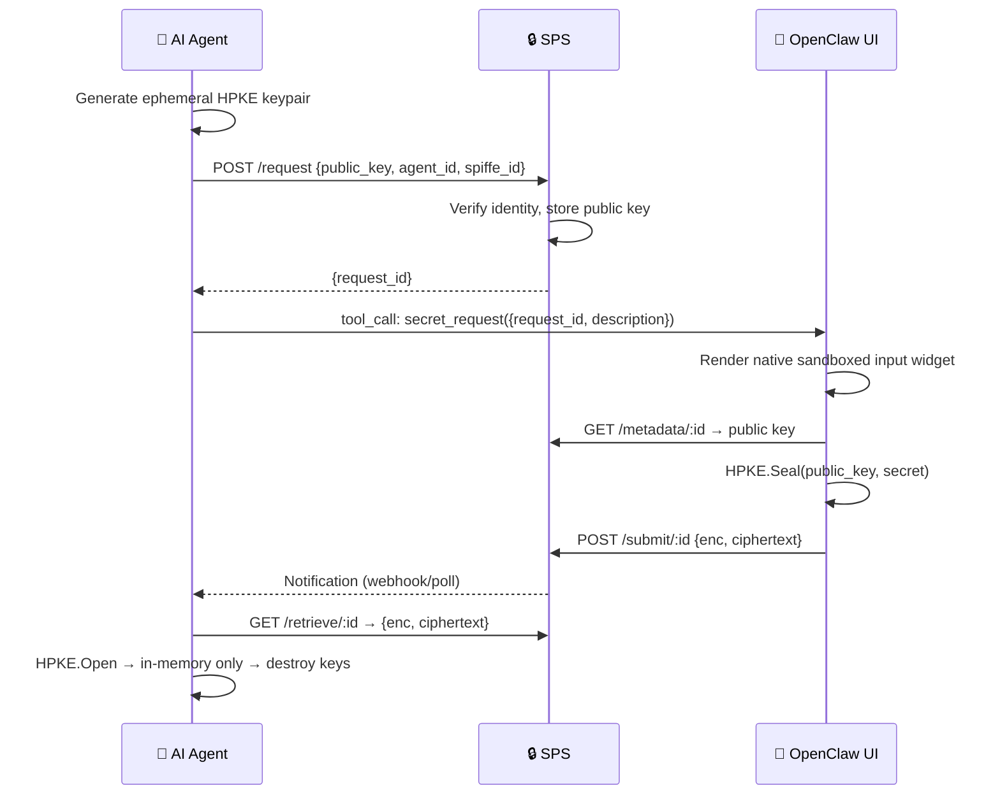
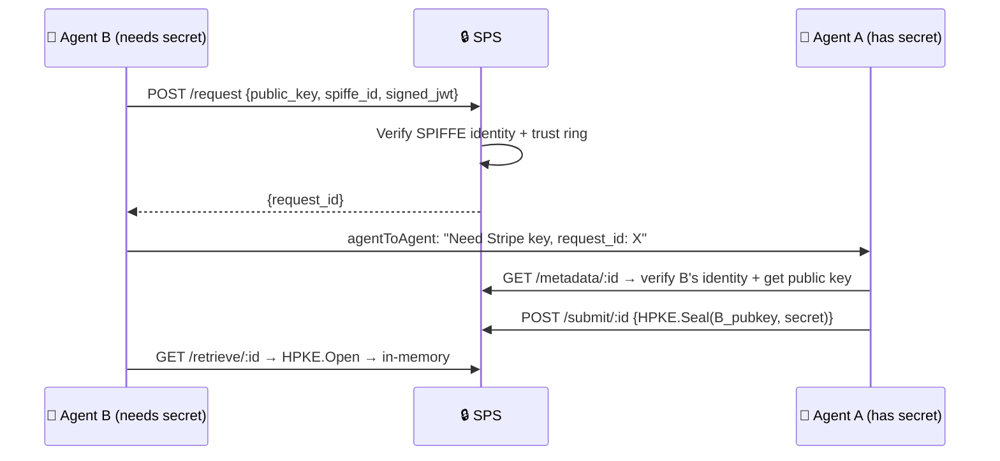
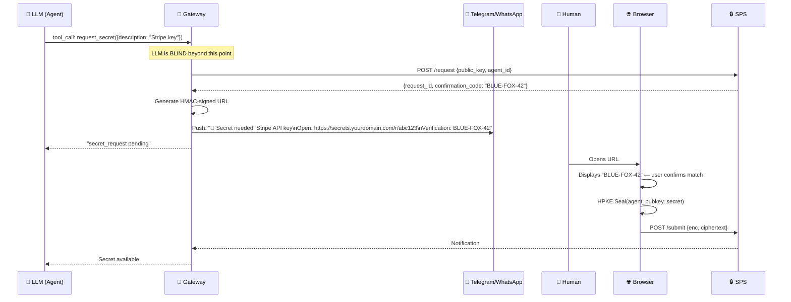

# 🔐 Secure Secret Input System for AI Agents — Final Design

> Zero-knowledge secret provisioning for **Human → Agent** and **Agent → Agent** flows.  
> All design decisions locked. Ready for implementation planning.

---

## 1. Problem & Goal

AI agents need credentials (API keys, tokens, passwords) but current methods — chat, config files, env vars — all leak secrets through logs, version control, or process access.

**Goal**: A **zero-knowledge Secret Provisioning Service (SPS)** where secrets are encrypted client-side and only decryptable by the intended agent.

---

## 2. Architecture



### Agent → Agent Flow



---

## 3. Locked Design Decisions

### 🔑 Cryptography: HPKE (RFC 9180)

| Config | Value |
|--------|-------|
| KEM | DHKEM(X25519, HKDF-SHA256) |
| KDF | HKDF-SHA256 |
| AEAD | AES-256-GCM |
| Mode | Base (single-shot) |

**Why**: Eliminates manual AES key wrapping, IV generation, and ciphertext concatenation. Standardized, vetted, unlimited payload size. Browser polyfill via **vendored `hpke-js`** (~15KB, audited, pinned version).

### 🛡️ Anti-Phishing: Platform-Adaptive Strategy

**OpenClaw UI** → Native sandboxed input widget (no URL, best security).  
**Telegram / WhatsApp / Slack** → Hardened Device Flow (see below).

### 📱 Chat Adapter Strategy: Hardened Device Flow (RFC 8628 Pattern)

For third-party chat platforms where we don't control the UI, we use a hardened variant of the **OAuth 2.0 Device Authorization Grant**:



> [!CAUTION]
> **The "Spoofed Match" Attack**: If the LLM generates both the URL and the confirmation code, prompt injection can spoof both — the user sees a matching code on a fake page and trusts it. **The LLM must never see the URL or the code.**

**Three mandatory Gateway-level security controls:**

| Control | Implementation |
|---------|---------------|
| **1. LLM Blindness** | LLM only emits `request_secret` tool call. Gateway generates URL, HMAC signature, and confirmation code. LLM receives only `"secret_request pending"`. |
| **2. Egress URL Filtering** | Gateway regex-scans all outbound messages. Any URL not matching `https://secrets.yourdomain.com/*` is **redacted or dropped** and flagged as a security breach. |
| **3. Strict TTL** | URL + confirmation code expire in **3 minutes**. Request ID invalidated immediately on ciphertext submission. Max 1 active request per agent per secret type. |

### 🪪 Agent Identity: SPIFFE/SPIRE + Lightweight Fallback

| Deployment | Identity Method |
|-----------|----------------|
| **Production/Multi-agent** | SPIFFE/SPIRE — SVIDs verified against trust bundle |
| **Local-first/Single-agent** | Gateway-signed Ed25519 keys (chain: Gateway root → Agent key → Ephemeral HPKE key) |

Trust Rings enforced via SPIFFE ID namespaces:
```
spiffe://myorg.local/ring/finance/crm-bot      ← same ring, free sharing
spiffe://myorg.local/ring/finance/payment-bot   ← same ring, free sharing  
spiffe://myorg.local/ring/devops/deploy-bot     ← cross-ring = human approval
```

### 💾 Secret Storage: In-Memory Only

- No disk writes. Agent crash = lazy re-request via HITL.
- Secrets in non-serializable objects, excluded from logs/prompts/stack traces.
- `Buffer.alloc()` with explicit zeroing on disposal.
- OS keychain integration deferred to **Phase 3** (opt-in).

### 🔄 Re-Request UX: Lazy (Wait Until Needed)

On agent restart, secrets are **not** immediately re-requested. Instead:
1. Agent attempts tool execution requiring the secret
2. Internal check fails (secret not in memory)
3. Agent emits `secret_request` with `re_request: true`
4. UI shows: "🔐 Re-enter your Stripe API key to continue"

This ties friction to the user's current intent — no spam on restart.

### 📦 Scope: Single-Tenant MVP

Multi-tenancy deferred. Focus Phase 1 on: HPKE correctness, SPIRE attestation in local dev, in-memory zeroing reliability.

---

## 4. SPS API

```
POST   /api/v2/secret/request        → {public_key, agent_id, spiffe_id, ttl, description}
GET    /api/v2/secret/metadata/:id   → {public_key, description, expiry}
POST   /api/v2/secret/submit/:id     → {enc, ciphertext}
GET    /api/v2/secret/retrieve/:id   → {enc, ciphertext, metadata}
DELETE /api/v2/secret/revoke/:id     → Cancel request
GET    /api/v2/secret/status/:id     → {status: pending|submitted|retrieved|expired}

# Agent-to-Agent (Phase 2)
POST   /api/v2/secret/delegate       → Agent A offers to share
GET    /api/v2/secret/delegations     → List pending offers
POST   /api/v2/secret/accept/:id     → Agent B accepts
```

**Auth**: SPIFFE SVID (production) · Gateway-signed JWT (local) · Session token (browser)

---

## 5. Defense-in-Depth (11 Layers)

| # | Layer | Threat Neutralized |
|---|-------|--------------------|
| 1 | HPKE ephemeral keys (per-request) | Key compromise → no forward exposure |
| 2 | Client-side encryption | Secret never plaintext on wire |
| 3 | Zero-knowledge SPS | Service compromise → no secrets exposed |
| 4 | Single-use request IDs + 3-min TTL | Replay attacks, stale requests |
| 5 | Native UI / Hardened Device Flow | Prompt injection → phishing |
| 6 | **LLM Blindness** | LLM never sees URL or confirmation code |
| 7 | **Gateway Egress Filtering** | LLM-injected malicious URLs redacted |
| 8 | SPIFFE/SPIRE identity | Agent impersonation |
| 9 | In-memory only + zeroing | Disk forensics, crash dumps |
| 10 | Audit logging + human notifications | Non-repudiation, rogue agents |
| 11 | TEE execution (optional) | Host OS compromise |

---

## 6. Implementation Roadmap

### Phase 1: Core MVP 🎯
- [x] SPS backend (Node.js + Redis)
- [x] HPKE encryption/decryption (vendored `hpke-js`)
- [~] OpenClaw UI native `secret_request` widget (Skipped — using standalone Browser UI fallback)
- [x] Hardened Device Flow adapter (Telegram/WhatsApp)
- [x] Gateway: LLM-blind URL + code generation
- [x] Gateway: Egress URL filtering (DLP)
- [x] Agent skill: key generation, secret retrieval, in-memory store
- [x] Lazy re-request flow
- [x] Gateway-signed agent identity (lightweight fallback)
- [x] Single-use request IDs with 3-min TTL
- [x] Audit logging

### Phase 2: Agent-to-Agent + Identity
- [ ] SPIFFE/SPIRE integration
- [ ] Trust ring policy engine
- [ ] Delegation API
- [ ] Cross-ring human approval workflow

### Phase 3: Enterprise
- [ ] Capability token proxy (SPS → API Gateway)
- [ ] OS keychain integration (opt-in)
- [ ] Multi-tenancy
- [ ] HSM/Cloud KMS, OAuth 2.0 token exchange
- [ ] TEE support, NIST compliance
