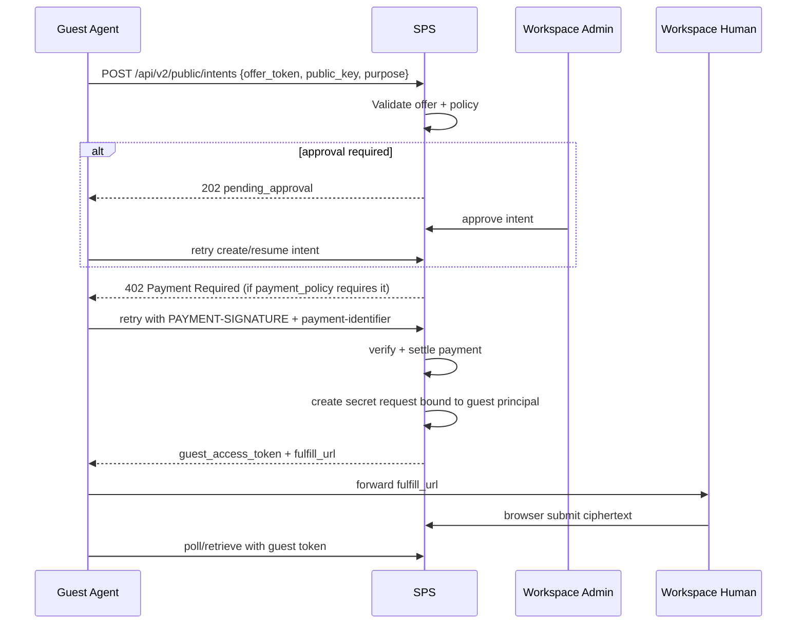
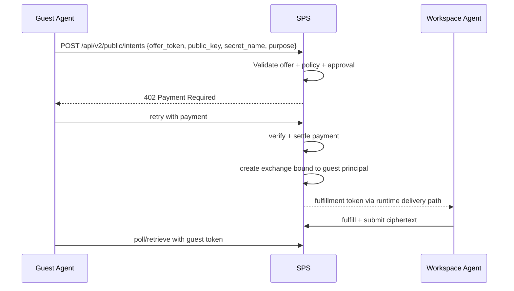

# Phase 3C: Paid Guest Secret Exchange

Build a public, one-time paid secret delivery path for **unregistered external requesters**. The recommended v1 path is a **guest agent paying via x402, then forwarding an SPS-hosted fulfill link to a workspace human** who supplies the secret. Follow-on variants may support guest humans and workspace-agent fulfillers, but Phase 3C starts from the guest-agent-to-human path because it reuses the safest existing browser submit flow without enrolling the guest as a workspace agent.

This phase exists because the current hosted architecture already has the right secret-delivery primitives, but they are split across two internal products:

- **Human -> Agent**: secure browser submit into a requester public key
- **Agent -> Agent**: pull-based exchange with policy, approval, and retrieval ownership
- **x402 in Phase 3D**: per-request overage payments for already authenticated workspace agents

None of those three pieces, by themselves, provide a safe public ingress path for an outside requester.

**Prerequisites**

- Phase 3A hosted platform is complete: workspaces, users, enrolled agents, RBAC, audit, billing, and rate limits
- Phase 3D payment rail abstractions for the chosen payment model (or equivalent internal provider/client abstractions) are available to reuse
- Phase 2A/2B exchange contracts exist; human-submit browser flow already exists

> [!IMPORTANT]
> Phase 3C is a **new product surface**, not just a small extension of the existing enrolled-agent x402 flow. The design intentionally avoids auto-enrolling temporary agents because that would pollute workspace quotas, budgets, audit semantics, and lifecycle management.

## Goals

- Let an external, unregistered requester initiate a one-time secret delivery flow into a hosted workspace
- Keep the workspace as the tenant boundary for policy, approval, audit, abuse controls, and pricing
- Support **agent-paid x402** for machine callers
- Preserve the existing zero-knowledge encryption model: the secret is still encrypted to the requester public key client-side
- Allow two fulfillment modes:
  - workspace **human** fulfills the request through the browser flow
  - workspace **agent** fulfills the request through the existing exchange protocol
- Reuse existing SPS route behavior where it is already correct instead of cloning secret-delivery logic

## Non-Goals

- No fully anonymous arbitrary requests against any workspace
- No reuse of `enrolled_agents` as a temporary guest identity store
- No recurring subscriptions over x402
- No public discovery of internal agent IDs, secret names, or workspace membership
- No "broadcast to anyone in the workspace" delivery semantics
- No production agent-fulfiller rollout until the existing production A2A transport is ready

## Why This Is A Separate Phase

Phase 3D x402 is intentionally scoped to **enrolled workspace agents** hitting payment-gated routes after a free monthly cap. The data model assumes:

- a stable `(workspace_id, agent_id)` requester identity
- optional `agent_allowances`
- workspace free-usage counters
- agent-specific audit and spend attribution

That is the wrong model for a public paid intake path. Guest traffic needs:

- a workspace-issued invitation or capability
- a short-lived guest requester identity
- a separate payment ledger and abuse surface
- explicit isolation from enrolled-agent quotas and admin UX

## Key Design Decisions

### 1. Start From A Workspace-Issued Offer, Not A Freeform Public Endpoint

Every guest flow starts from a **workspace-created offer/invite**. The guest never supplies a freeform `workspace_id` and must not be allowed to probe arbitrary internal agents or secret names.

An offer binds:

- `workspace_id`
- `delivery_mode`: `human`, `agent`, or `either`
- `payment_policy`: `free`, `always_x402`, or `quota_then_x402`
- `price_usd_cents`
- optional `included_free_uses` when `payment_policy=quota_then_x402`
- `secret_policy`:
  - exact `secret_name`
  - or a curated alias/product code resolved server-side
- optional pinned `allowed_fulfiller_id`
- whether approval is required
- TTL / max uses / status

### 2. Model A First-Class Guest Requester, Not A Temporary Agent

Guest requesters are represented as their own actor type:

- `guest_agent`
- `guest_human`

They authenticate with a **short-lived guest requester token** or equivalent request-bound capability minted only after allow/approval/payment checks pass.

This preserves the distinction between:

- managed workspace actors (`user`, `agent`)
- public external actors (`guest_agent`, `guest_human`)

### 3. Charge Only After The Request Is Allowed

If a guest request would land in `pending_approval`, SPS should create a guest intent and wait for approval **before** issuing a payable x402 challenge. Otherwise the platform immediately inherits refund and dispute complexity for denied requests.

Ordering for approval-gated flows:

1. Guest creates intent
2. SPS evaluates offer and policy
3. If approval is required, SPS records `pending_approval`
4. Workspace approves or rejects
5. Guest retries or resumes
6. SPS issues payment challenge
7. SPS creates the delivery request only after successful settlement

`payment_policy` rules:

- `free`: no payment challenge is issued
- `always_x402`: every allowed intent returns `402 Payment Required`
- `quota_then_x402`: SPS allows the offer's included free quota first, then returns `402` for each later request so the guest agent can continue paying per request

Guest-offer quota state is tracked separately from enrolled-agent `agent_allowances` and `workspace_exchange_usage`. The shared x402 rail is reused, but the quota bucket and ledger stay guest-scoped.

### 3A. Paid Intents Run On A Settled Policy Snapshot

Once SPS accepts payment for a guest intent, it should persist a **settled policy snapshot** bound to that `intent_id`. That snapshot includes:

- offer configuration used at settlement time
- resolved secret binding / alias
- approval outcome and approver reference
- requester identity and public key
- effective policy hash / version

After settlement:

- ordinary workspace policy edits should **not** invalidate the paid guest intent
- retrieval and fulfillment continue against the settled snapshot
- only platform emergency overrides, hard revocations, expiry, or abuse/safety shutdowns may still block the flow

This avoids refund and dispute friction when an admin edits normal workspace policy after the guest has already paid.

### 4. Human Fulfillment Reuses The Existing Browser Submit Path With A Capability Split

For `delivery_mode=human`, Phase 3C should reuse the current Human -> Agent secret flow wherever possible:

- guest requester provides an HPKE public key
- SPS creates a normal secret request record bound to the guest actor
- after allow/approval/payment checks, SPS returns **two different capabilities**:
  - `guest_access_token` for the requester: status + retrieve only
  - `fulfill_url` for the human: metadata + submit only
- the guest agent forwards only the `fulfill_url` to the human fulfiller
- human fulfills through the existing browser UI and `POST /api/v2/secret/submit/:id`

This is the fastest and lowest-risk v1 because the secure browser encryption path already exists and the requester never receives a submit-capable browser token.

### 5. Agent Fulfillment Reuses The Existing Exchange Contract

For `delivery_mode=agent`, Phase 3C reuses the exchange record/policy/approval/retrieval model:

- guest requester is treated as the authenticated requester principal
- SPS creates an exchange request bound to the guest actor and workspace
- the workspace agent fulfills through the normal fulfillment token path

This should ship only after the current production A2A delivery path is ready for external-facing traffic.

### 6. Guest Payment State Stays Separate From Agent Allowances

Phase 3C must not debit or depend on `agent_allowances`. Guest payment state belongs to the guest intent/session lifecycle. The same x402 provider abstraction can be reused, but the ledger and lifecycle records should be guest-scoped.

### 7. Human Trust Comes From SPS-Controlled Request Details, Not Guest-Relayed Codes

In the guest-agent-to-human path, the guest agent is the party forwarding the fulfill link. Because of that, Phase 3C should not rely on a guest-relayed confirmation code as the primary anti-phishing control.

Instead, the SPS-hosted fulfill page should show immutable request details controlled by SPS:

- workspace or offer label
- request category / secret alias
- requester label
- purpose
- expiry
- hosted SPS branding/domain warnings

The signed `fulfill_url` remains the actual capability. Any displayed confirmation code is informational only and must not be treated as a second independently trusted factor when the guest is the relay.

## System Model

### Actors

- **Workspace admin/operator**: creates and revokes public offers, reviews approvals, inspects audit
- **Guest requester**: outside agent or human with no enrolled-agent record
- **Human fulfiller**: browser user who submits encrypted ciphertext
- **Agent fulfiller**: workspace-managed agent that presents a fulfillment token
- **SPS**: trust anchor for offer validation, policy, payment, and audit

### Product Variants

#### Variant A: Guest Agent -> Human Fulfiller

This is the recommended v1.



#### Variant B: Guest Requester -> Agent Fulfiller

This is the follow-on variant once production A2A transport is ready.



## Proposed Project Structure Additions

```text
packages/sps-server/
  src/
    routes/
      public-exchange.ts          # [NEW] Public guest intent/payment/request routes
      public-offers.ts            # [NEW] Authenticated workspace offer CRUD
      public-intent-approvals.ts  # [NEW] Authenticated guest intent approve/reject routes
    services/
      guest-offer.ts              # [NEW] Offer lifecycle and validation
      guest-intent.ts             # [NEW] Guest request intent/session lifecycle
      guest-payment.ts            # [NEW] Guest payment ledger + idempotency
      requester-auth.ts           # [NEW] Guest requester token mint/verify helpers
    db/migrations/
      009_public_offers.sql       # [NEW] Offer records
      010_guest_intents.sql       # [NEW] Guest requester intents/sessions
      011_guest_payments.sql      # [NEW] Guest payment ledger

packages/dashboard/
  src/pages/
    PublicOffers.tsx              # [NEW] Admin/operator offer management
    PublicIntentDetail.tsx        # [NEW] Intent drill-down / manual recovery
```

## Data Model

### `public_exchange_offers`

Purpose: workspace-issued capability describing what a guest is allowed to ask for.

Suggested columns:

- `id UUID PRIMARY KEY`
- `workspace_id UUID NOT NULL`
- `offer_token_hash TEXT NOT NULL UNIQUE`
- `status TEXT NOT NULL CHECK (status IN ('active', 'revoked', 'expired'))`
- `delivery_mode TEXT NOT NULL CHECK (delivery_mode IN ('human', 'agent', 'either'))`
- `payment_policy TEXT NOT NULL CHECK (payment_policy IN ('free', 'always_x402', 'quota_then_x402'))`
- `price_usd_cents BIGINT NOT NULL`
- `included_free_uses INTEGER NULL`
- `secret_name TEXT NULL`
- `secret_alias TEXT NULL`
- `allowed_fulfiller_id TEXT NULL`
- `require_approval BOOLEAN NOT NULL DEFAULT true`
- `max_uses INTEGER NULL`
- `uses_consumed INTEGER NOT NULL DEFAULT 0`
- `expires_at TIMESTAMPTZ NULL`
- `created_by_actor_type TEXT NOT NULL`
- `created_by_actor_id TEXT NOT NULL`
- `created_at TIMESTAMPTZ NOT NULL DEFAULT now()`
- `updated_at TIMESTAMPTZ NOT NULL DEFAULT now()`

### `guest_exchange_intents`

Purpose: records the external requester lifecycle before and after payment.

Suggested columns:

- `id UUID PRIMARY KEY`
- `workspace_id UUID NOT NULL`
- `offer_id UUID NOT NULL REFERENCES public_exchange_offers(id)`
- `guest_actor_type TEXT NOT NULL CHECK (guest_actor_type IN ('guest_agent', 'guest_human'))`
- `guest_actor_id TEXT NOT NULL`
- `requester_public_key TEXT NOT NULL`
- `delivery_mode TEXT NOT NULL CHECK (delivery_mode IN ('human', 'agent'))`
- `secret_name TEXT NULL`
- `purpose TEXT NOT NULL`
- `fulfiller_hint TEXT NULL`
- `status TEXT NOT NULL CHECK (status IN ('pending_approval', 'approved', 'rejected', 'payment_required', 'payment_pending', 'paid', 'request_created', 'exchange_created', 'submitted', 'retrieved', 'expired', 'revoked'))`
- `approval_reference TEXT NULL`
- `payment_provider TEXT NULL`
- `payment_reference TEXT NULL`
- `request_id TEXT NULL`
- `exchange_id TEXT NULL`
- `guest_token_jti TEXT NULL`
- `expires_at TIMESTAMPTZ NOT NULL`
- `created_at TIMESTAMPTZ NOT NULL DEFAULT now()`
- `updated_at TIMESTAMPTZ NOT NULL DEFAULT now()`

### `guest_payment_transactions`

Purpose: guest-scoped payment ledger and idempotency store.

Suggested columns:

- `id UUID PRIMARY KEY`
- `workspace_id UUID NOT NULL`
- `offer_id UUID NOT NULL`
- `intent_id UUID NOT NULL`
- `payment_provider TEXT NOT NULL`
- `payment_id TEXT NOT NULL`
- `request_hash TEXT NOT NULL`
- `quoted_amount_cents BIGINT NOT NULL`
- `quoted_currency TEXT NOT NULL DEFAULT 'USD'`
- `quoted_asset_symbol TEXT NULL`
- `quoted_asset_amount TEXT NULL`
- `network_id TEXT NULL`
- `tx_hash TEXT NULL`
- `status TEXT NOT NULL CHECK (status IN ('pending', 'verified', 'settled', 'failed', 'expired'))`
- `response_cache JSONB NULL`
- `created_at TIMESTAMPTZ NOT NULL DEFAULT now()`
- `settled_at TIMESTAMPTZ NULL`
- `UNIQUE (intent_id, payment_id)`

## Endpoint Sketch

### Authenticated Workspace Routes

| Endpoint | Auth | Behavior |
|----------|------|----------|
| `POST /api/v2/public/offers` | User JWT (`workspace_operator+`) | Create a public guest offer |
| `GET /api/v2/public/offers` | User JWT (`workspace_operator+`) | List active/revoked offers |
| `POST /api/v2/public/offers/:id/revoke` | User JWT (`workspace_operator+`) | Revoke an offer immediately |
| `GET /api/v2/public/intents/:id` | User JWT (`workspace_operator+`) | Inspect a guest intent and its payment/delivery state |
| `POST /api/v2/public/intents/:id/approve` | User JWT (`workspace_operator+`) | Approve a pending guest intent so it may become payable or ready |
| `POST /api/v2/public/intents/:id/reject` | User JWT (`workspace_operator+`) | Reject a pending guest intent before any payment is accepted |

### Public Guest Routes

| Endpoint | Auth | Behavior |
|----------|------|----------|
| `POST /api/v2/public/intents` | None | Create or resume a guest intent from an offer token; may return `202 pending_approval`, `402 Payment Required`, or `201` with created request/exchange |
| `GET /api/v2/public/intents/:id/status` | None or guest token | Read pending approval/payment state without revealing workspace internals |
| `DELETE /api/v2/public/intents/:id` | Guest token | Cancel an unfulfilled guest intent |

### Guest Access Token

After successful payment, SPS mints a short-lived requester token with claims such as:

```json
{
  "iss": "sps",
  "aud": "sps-guest",
  "sub": "guest:9d0d4c3a-...",
  "workspace_id": "ws_123",
  "actor_type": "guest_agent",
  "offer_id": "offer_123",
  "intent_id": "intent_123",
  "caps": ["request:retrieve", "exchange:retrieve", "exchange:status"],
  "exp": 1760000000
}
```

This token is used only for the specific request/exchange lifecycle. It must not be accepted by admin, listing, or general enrolled-agent routes.

### Human Fulfill Capability

After successful allow/approval/payment handling for `delivery_mode=human`, SPS also returns a signed `fulfill_url` scoped only for:

- `GET /api/v2/secret/metadata/:id`
- `POST /api/v2/secret/submit/:id`

The fulfill capability must not allow retrieval, status listing across other intents, or any admin operation.

### Settled Policy Snapshot Enforcement

For paid guest intents, later lifecycle steps (`status`, human submit, guest retrieve) should read authorization from the settled snapshot created at payment time rather than re-evaluating mutable workspace policy on every step.

The only exceptions are platform-level emergency restrictions such as:

- a global deny for a compromised requester or agent id
- a platform abuse shutdown for a payment rail, offer class, or workspace
- explicit operator revocation of the specific intent

## Request Lifecycle

### Human Delivery Mode (Guest Agent -> Human Fulfiller)

1. Guest submits `offer_token`, `public_key`, and `purpose`
2. SPS validates the offer and creates an intent
3. If approval is required, SPS returns `pending_approval`
4. Once allowed, SPS either:
   - creates the request immediately when `payment_policy=free`
   - returns `402 Payment Required` when `payment_policy=always_x402`
   - or returns `402` only after the offer's free quota is exhausted when `payment_policy=quota_then_x402`
5. Guest retries with payment proof when required
6. SPS settles payment if required and creates a regular secret request bound to the guest actor
7. SPS returns:
   - `guest_access_token`
   - `intent_id`
   - `request_id`
   - `fulfill_url`
   - optional display-only request summary for the human page
8. Guest agent forwards only `fulfill_url` to the workspace human
9. Workspace human fulfills through the existing browser UI
10. Guest polls status and retrieves once

The guest does **not** receive a submit-capable browser token beyond the purpose-built `fulfill_url` it forwards to the human.

### Human Fulfill Page Requirements

The page opened through `fulfill_url` should show SPS-controlled immutable details before secret entry:

- workspace or offer label
- requester label
- purpose
- secret alias or request category
- expiry
- hosted SPS branding and warning text

This page should not rely on a guest-relayed confirmation code as its primary trust signal.

### Agent Delivery Mode

1. Guest submits `offer_token`, `public_key`, `secret_name`, and `purpose`
2. SPS validates offer and policy
3. Approval path behaves the same as human mode
4. SPS returns `402 Payment Required`
5. Guest retries with payment proof
6. SPS settles payment and creates an exchange bound to the guest actor
7. SPS returns:
   - `guest_access_token`
   - `exchange_id`
   - `fulfillment_token` or equivalent delivery reference
8. Workspace agent fulfills through the normal exchange path
9. Guest polls status and retrieves once

## Security Model

### Offer Hardening

- Store only a hash of the public offer token
- Keep offer tokens high-entropy and unguessable
- Reject expired/revoked offers before any payment step
- Allow exact secret binding or curated aliases only; do not accept arbitrary internal `secret_name` values by default

### Abuse Controls

- Per-IP and per-offer rate limits on public intent creation
- One active unpaid intent per `(offer_id, external requester)` tuple
- Require payment only after approval/allow resolution
- Short TTL on unpaid/payment-pending intents
- Minimal public status responses to avoid workspace enumeration
- Treat post-payment intent invalidation as exceptional: use settled snapshots for normal policy drift and reserve denial-after-payment for emergency overrides only

### Data Minimization

- Audit should record guest actor type and opaque guest actor id, not raw wallet secrets or plaintext human-entered descriptions unless operationally necessary
- Guest-facing responses must not reveal internal workspace members, disabled secret names, or denied fulfiller identities

### Retrieval Ownership

- Guest retrieval remains one-time
- Guest access token is bound to the single request/exchange intent
- Replays after retrieval, revoke, expiry, or settlement failure must fail closed

## Payment Model

### Agent Requesters

External guest agents should use x402 directly. This matches the existing HTTP-native payment flow already planned for the agent SDK/runtime.

The canonical rule for machine requesters is:

- free while the configured quota is available
- then x402 per request once the quota or included limit is exhausted

### Human Requesters

Human browser requesters may later use:

- x402 via wallet-enabled browser flow
- or a hosted crypto checkout/payment-link flow

Phase 3C should keep the payment abstraction open, but the first machine-to-machine path should be **x402**, especially for the guest-agent-to-human v1 flow.

## Recommended Rollout

### Milestone 1: Offer Lifecycle + Guest Intent Core

- Offer CRUD for workspace admins/operators
- Guest intent creation, status, expiry, and revocation
- Guest requester token minting
- `payment_policy` support including `quota_then_x402`
- Guest intent approval / rejection control-plane endpoints

### Milestone 2: Guest -> Human Delivery

- Guest agent -> human fulfiller flow
- Approval -> payment -> request creation ordering
- Reuse existing browser submit flow
- Capability split: `guest_access_token` vs `fulfill_url`
- Settled policy snapshot bound to `intent_id` after payment
- Guest retrieve/status support

### Milestone 3: Guest x402 Payment Flow

- Guest payment quote/idempotency/settlement ledger
- Response caching and retry safety
- Audit and support metadata for guest-paid requests

### Milestone 4: Guest -> Agent Delivery

- Reuse exchange creation and retrieval semantics
- Add guest requester support in policy and audit
- Ship only after production A2A transport is ready

### Milestone 5: Dashboard + Operations

- Public offer management page
- Guest intent drill-down
- Spend visibility, alerting, stuck-intent recovery, and abuse analytics

## Acceptance Criteria

- A guest agent can pay via x402, forward a fulfill link to a workspace human, and complete a one-time flow without becoming an enrolled agent
- Payment is never captured for a request that is still pending approval
- `quota_then_x402` lets a guest continue paying per request after the included free quota is exhausted
- Human fulfillment works with the existing browser encryption model
- Guest retrieval remains one-time and requester-bound
- The requester and human fulfiller never share the same retrieval/submit capability
- Ordinary workspace policy edits after settlement do not void a paid guest intent; only emergency overrides or explicit revocation can do that
- Offer misuse, token replay, and payment-id reuse fail closed
- Guest traffic is visible in audit and operations views without leaking secrets
