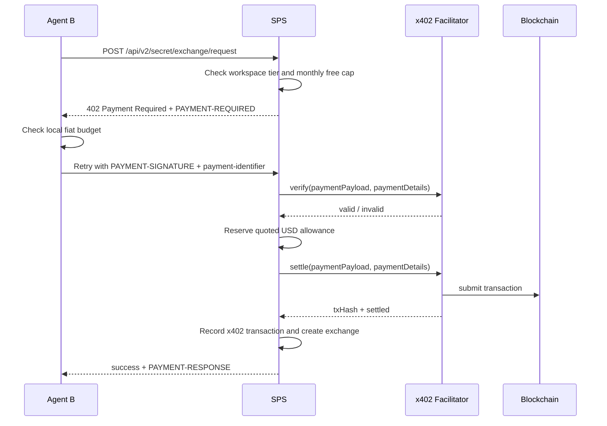

# Phase 3D: Autonomous Payments & Crypto Billing

Split the payments roadmap out of the broader hosted product roadmap. Phase 3D owns the payment systems that sit beside recurring workspace subscriptions:

- **agent-paid x402 overages** for enrolled workspace agents
- **real Node-runtime x402 payer support**
- **hosted crypto checkout** for fixed-term plan purchases

This phase is intentionally separate from:

- **Phase 3B**: operator dashboard and recurring billing admin UX
- **Phase 3C**: public paid guest requester flows
- **Phase 3E**: hosted analytics, abuse hardening, ecosystem work, and production launch

## Prerequisites

- Phase 3A hosted platform is complete
- Phase 3B billing dashboard and provider-agnostic recurring billing read model exist
- Phase 2A/2B exchange routes exist for paid agent exchange creation

> [!IMPORTANT]
> Phase 3D is about **payments and billing mechanics**, not generic hosted operations. Keeping it separate prevents the dashboard roadmap from being blocked by facilitator, wallet, or settlement work.

## Goals

- Let enrolled workspace agents pay per-request overages using x402 after a free cap is exhausted
- Establish the canonical machine-payment rule as **free until quota/limit is exhausted, then x402 per request**
- Keep recurring workspace subscriptions separate from x402 request payments
- Add a real Node-runtime payer path so agents can pay without a browser wallet
- Add a hosted crypto checkout for human admins purchasing a fixed-term workspace plan
- Preserve strict idempotency, settlement-before-release, and auditable payment ledgers

## Non-Goals

- No guest requester product surface here; that lives in Phase 3C
- No true recurring subscriptions over x402
- No merging hosted crypto checkout into the recurring Stripe portal abstraction
- No direct blockchain logic inside SPS; facilitator/provider abstractions remain mandatory

## Current Repo State

The current codebase already contains the first slice of enrolled-agent x402 overage support in `packages/sps-server`:

- x402 quote generation and header contracts
- facilitator-backed verify/settle provider abstraction
- per-agent allowance and spend tracking
- paid exchange creation after settlement
- transaction ledger + inflight lease tables

The remaining work is to harden that flow into a real payer/runtime path and to add the separate hosted crypto billing lane.

Phase 3C reuses this x402 rail for guest offers that choose `payment_policy=quota_then_x402` or `always_x402`, but guest quotas and ledgers remain separate from enrolled-agent allowance state.

## Milestone 1: Enrolled-Agent x402 Overage Payments

Implement zero-human-in-the-loop payment flows for enrolled workspace agents using the [x402.org](https://www.x402.org/) open standard (v2). The initial scope is intentionally narrow:

- payment-gated **agent-authenticated** routes only
- first gated route: `POST /api/v2/secret/exchange/request`
- **free-tier** workspaces get a monthly free cap
- **paid-tier** workspaces bypass the x402 gate

> [!NOTE]
> Public paid guest requesters are not part of this milestone. They are tracked separately in [Phase 3C - Paid Guest Secret Exchange](Phase%203C%20-%20Paid%20Guest%20Secret%20Exchange.md).
> The reusable payment rule still aligns: machine requesters can continue after quota exhaustion by paying per request via x402.

### Protocol Overview

x402 is an HTTP-native payment standard. When a resource requires payment, SPS returns `402 Payment Required` and a `PAYMENT-REQUIRED` header. The client constructs a payment payload and retries with a `PAYMENT-SIGNATURE` header. SPS verifies and settles through a facilitator/provider abstraction before releasing the paid resource.

In the initial implementation:

- pricing is defined internally in **USD cents**
- SPS quotes **USDC on Base Sepolia**
- v1 uses a fixed `1 USD = 1 USDC` quote ratio
- the first price point is a flat **$0.05** overage per exchange request

### x402 Flow



### Server Rules

- Free-tier workspaces receive **10 free exchange requests per workspace per UTC calendar month**
- Overage exchange requests are billed at **$0.05 USD**
- SPS quotes only **USDC on Base Sepolia** using `eip155:84532` in v1
- `payment-identifier` is required and acts as the idempotency key
- settlement must succeed before the paid exchange resource is created

This same economic pattern is the baseline for guest-agent offers in Phase 3C:

- allow free usage while the configured guest quota remains
- then return `402 Payment Required`
- after successful settlement, continue the request as a paid per-request activation

### Data Model

```sql
CREATE TABLE IF NOT EXISTS agent_allowances (
  id UUID PRIMARY KEY DEFAULT gen_random_uuid(),
  workspace_id UUID NOT NULL REFERENCES workspaces(id),
  agent_id TEXT NOT NULL,
  monthly_budget_cents BIGINT NOT NULL DEFAULT 0,
  current_spend_cents BIGINT NOT NULL DEFAULT 0,
  budget_reset_at TIMESTAMPTZ NOT NULL DEFAULT date_trunc('month', now()) + INTERVAL '1 month',
  created_at TIMESTAMPTZ NOT NULL DEFAULT now(),
  updated_at TIMESTAMPTZ NOT NULL DEFAULT now(),
  UNIQUE (workspace_id, agent_id)
);

CREATE TABLE IF NOT EXISTS workspace_exchange_usage (
  workspace_id UUID NOT NULL REFERENCES workspaces(id),
  usage_month DATE NOT NULL,
  free_exchange_used INTEGER NOT NULL DEFAULT 0,
  updated_at TIMESTAMPTZ NOT NULL DEFAULT now(),
  PRIMARY KEY (workspace_id, usage_month)
);

CREATE TABLE IF NOT EXISTS x402_transactions (
  id UUID PRIMARY KEY DEFAULT gen_random_uuid(),
  workspace_id UUID NOT NULL REFERENCES workspaces(id),
  agent_id TEXT NOT NULL,
  payment_id TEXT NOT NULL,
  request_hash TEXT NOT NULL,
  quoted_amount_cents BIGINT NOT NULL,
  quoted_currency TEXT NOT NULL DEFAULT 'USD',
  quoted_asset_symbol TEXT NOT NULL DEFAULT 'USDC',
  quoted_asset_amount TEXT NOT NULL,
  scheme TEXT NOT NULL,
  network_id TEXT NOT NULL,
  resource_type TEXT NOT NULL,
  resource_id TEXT,
  tx_hash TEXT,
  facilitator_url TEXT,
  quote_expires_at TIMESTAMPTZ,
  status TEXT NOT NULL DEFAULT 'pending'
    CHECK (status IN ('pending', 'verified', 'settled', 'failed')),
  settled_at TIMESTAMPTZ,
  response_cache JSONB,
  response_cache_expires_at TIMESTAMPTZ,
  created_at TIMESTAMPTZ NOT NULL DEFAULT now(),
  UNIQUE (workspace_id, payment_id)
);

CREATE TABLE IF NOT EXISTS x402_inflight (
  workspace_id UUID NOT NULL REFERENCES workspaces(id),
  agent_id TEXT NOT NULL,
  payment_id TEXT NOT NULL,
  lease_expires_at TIMESTAMPTZ NOT NULL,
  created_at TIMESTAMPTZ NOT NULL DEFAULT now(),
  PRIMARY KEY (workspace_id, agent_id),
  UNIQUE (workspace_id, payment_id)
);
```

### Execution Model

Payment-gated routes use a `preHandler`-style intercept:

1. Check whether the route requires payment
2. For free-tier workspaces, inspect monthly free usage
3. If still inside the free cap, proceed normally
4. If payment is required and `PAYMENT-SIGNATURE` is missing, return `402`
5. Require `payment-identifier`
6. Acquire a `(workspace_id, agent_id)` inflight lease
7. Verify the payment payload through the facilitator
8. Reserve the quoted allowance atomically
9. Settle through the facilitator
10. On success, create the paid resource and persist the ledger
11. On failure, roll back reserved spend, mark the transaction failed, and release the lease

### Dashboard / Admin Surface

Phase 3B owns the human-facing billing UI, but this phase defines the new payment-specific backend surfaces that the dashboard consumes:

| Endpoint | Auth | Behavior |
|----------|------|----------|
| `POST /api/v2/billing/allowances` | User JWT (admin) | Set or update an agent's monthly x402 budget |
| `GET /api/v2/billing/allowances` | User JWT (admin) | List budgets and current spend per agent |
| `GET /api/v2/billing/x402/transactions` | User JWT (admin) | Paginated x402 transaction ledger |

### Environment Variables

| Variable | Used By | Purpose |
|----------|---------|---------|
| `SPS_X402_FACILITATOR_URL` | sps-server | Facilitator base URL for `/verify` and `/settle` |
| `SPS_X402_PAY_TO_ADDRESS` | sps-server | Treasury/pay-to wallet address |
| `SPS_X402_ENABLED` | sps-server | Enable x402 payment-gated routes |
| `SPS_X402_PRICE_USD_CENTS` | sps-server | Flat overage price per paid exchange |
| `SPS_X402_FREE_EXCHANGE_MONTHLY_CAP` | sps-server | Free-tier monthly free exchange cap |
| `SPS_X402_NETWORK_ID` | sps-server | Development network id (default: `eip155:84532`) |

### Acceptance

- A free-tier workspace gets 10 free exchange requests per UTC month before SPS returns `402`
- An enrolled agent can autonomously pay `$0.05` in USDC on Base Sepolia after the cap is exhausted
- Missing allowance rows deny paid requests by default
- Idempotent retries with the same `payment-identifier` return the cached success result
- Concurrent x402 attempts for the same agent are serialized safely

## Milestone 2: Real Agent-Paid x402 (Node Runtime)

Replace the mock/demo payment path with a real Node-runtime payer implementation.

### Scope

- Replace the mock-only facilitator payload/response contract with the official x402 buyer/seller contract
- Add a Node-based x402 payment provider in `packages/agent-skill`
- Wire `x402PaymentProvider` and `x402BudgetProvider` through the real OpenClaw/runtime bridge path
- Restrict the first production-like implementation to `exact` scheme on Base Sepolia
- Validate quote expiry and fail closed on unsupported schemes/networks
- Expand ledger/audit metadata with payer address, facilitator error details, and final tx hash

### Signer Boundary

The payer private key must not be treated like an ordinary secret exposed to the main agent/LLM context.

Recommended boundary:

- the runtime requests `signPayment(quote)` from a dedicated payer provider
- the provider returns only the signed payload or signature material required for x402
- the runtime never receives raw private key bytes unless explicitly running in a local/dev fallback mode

Recommended implementations, in order:

1. remote signer / wallet daemon / KMS / HSM / OS keychain backed signer
2. local encrypted keystore unlocked by the operator
3. dev-only in-process key material with `Buffer.alloc()` style zeroing and strong operator warnings

This keeps payment authorization as a narrow capability boundary instead of another value living in normal LLM-readable memory.

### Operational Readiness

- Dedicated test wallet with Base Sepolia ETH + testnet USDC
- Per-agent, per-workspace, and daily spend ceilings
- Global kill switch for x402 overage payments
- Reconciliation, stuck-payment monitoring, and alerting for failed verify/settle transitions
- signer boundary telemetry and failure handling so operators can distinguish wallet misconfiguration from facilitator failures

### Acceptance

- A real runtime agent can pay for `POST /api/v2/secret/exchange/request` without browser wallet participation
- SPS verifies and settles against a real facilitator endpoint before creating the exchange
- Quote expiry, unsupported network/scheme, insufficient balance, and facilitator failures all fail closed
- the main agent runtime can trigger payment signing without directly reading or exporting the payer private key

## Milestone 3: Hosted Crypto Billing Checkout

Add a separate human-admin crypto purchase lane for workspace plan upgrades and renewals.

### Product Rules

- Use **Coinbase Payment Links** (or equivalent hosted crypto checkout), not the recurring Stripe subscription abstraction
- Treat the first crypto SKU as a **fixed-term Standard plan purchase**
- Store provider payment reference plus `plan_expires_at`
- Downgrade back to Free when the term expires and no renewal is present

### Why This Is Separate From x402

- `x402` is optimized for machine-to-machine, per-request HTTP payments
- hosted crypto checkout is a human-admin, browser-based plan purchase flow
- both belong in the broader payments roadmap, but they should not be forced into one lifecycle or one provider abstraction

### Backend Shape

| Endpoint | Auth | Behavior |
|----------|------|----------|
| `POST /api/v2/billing/crypto/checkout` | User JWT (admin) | Create a hosted crypto checkout/payment link for a selected plan SKU |
| `POST /api/v2/billing/crypto/webhook` | Provider webhook | Validate provider signature and activate/renew the purchased plan term |

Suggested recurring-billing extensions:

- `billing_provider` may now distinguish subscription-backed vs hosted-crypto-managed plans
- add `provider_payment_reference`
- add `plan_expires_at`
- keep Stripe portal behavior disabled for Coinbase-managed workspaces

### Acceptance

- A verified workspace admin can start a hosted crypto checkout from the billing page
- A successful provider webhook upgrades or renews the workspace term exactly once
- Coinbase-managed workspaces show the correct renewal path and never expose an invalid Stripe billing portal flow

## Verification Plan

Detailed E2E and integration scenarios for this phase live in `docs/testing/Phase 3D.md`.

## Resolved Decisions

- **Payment split**: recurring workspace subscriptions remain separate from x402 request payments
- **x402 scope**: the first shipped implementation is enrolled-agent overage payment, but the same rail is reusable for guest-agent `quota_then_x402` activation in Phase 3C
- **Signer isolation**: payer private keys live behind a dedicated signer/provider boundary and are not normal LLM-accessible process state in production
- **Guest traffic**: public paid guest requesters remain a separate Phase 3C product surface
- **Crypto billing**: hosted crypto checkout is a fixed-term plan purchase, not an auto-renewing subscription
