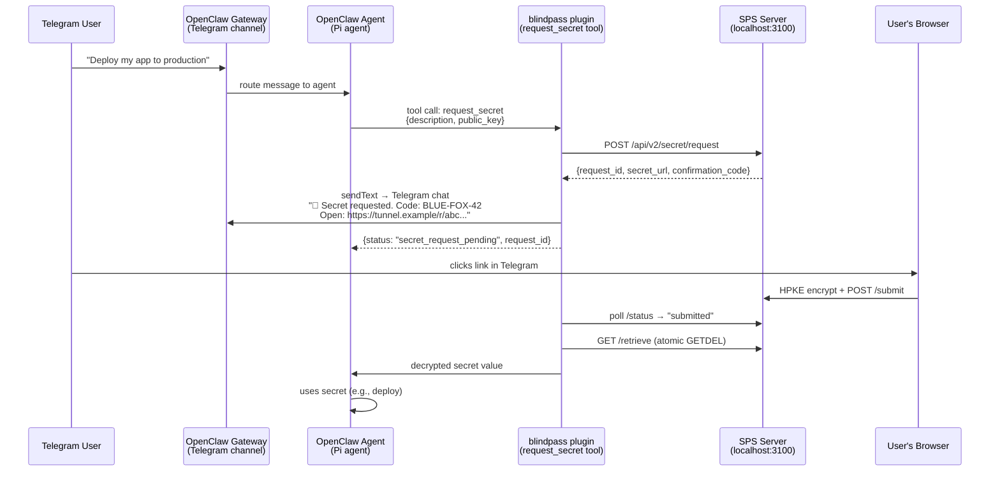

# OpenClaw + Telegram Integration Test Plan

Build an OpenClaw plugin (`openclaw-plugin-blindpass`) and an agent skill that together enable an OpenClaw agent to securely request secrets via Telegram. This plan covers what to build, how to wire it, and how to test the full flow.

## User Review Required

> [!IMPORTANT]
> **Telegram Bot Token**: You'll need a Telegram bot token (from @BotFather) to test this. Do you already have one configured in your OpenClaw setup, or should we create a new dev bot?

> [!IMPORTANT]
> **SPS Public URL**: The SPS server must be reachable from Telegram (the user clicks a link on their phone). For dev testing we'll use **ngrok** or **Tailscale Funnel** to expose `localhost:3100`. Which do you prefer, or do you have another tunnel solution?

> [!IMPORTANT]
> **OpenClaw Installation**: This plan assumes you have OpenClaw installed and running with Telegram already connected. Please confirm this is the case.

---

## Architecture Overview



---

## Proposed Changes

### 1. OpenClaw Plugin (`packages/openclaw-plugin/`)

This is the primary integration piece — an OpenClaw plugin that registers a `request_secret` tool the agent can invoke.

#### [NEW] `packages/openclaw-plugin/openclaw.plugin.json`
Plugin manifest file:
```json
{
  "id": "blindpass",
  "name": "Secure Secret Provisioning",
  "version": "0.1.0",
  "description": "Zero-knowledge secret provisioning via HPKE encryption"
}
```

#### [NEW] `packages/openclaw-plugin/index.mjs`
Plugin entry point using the OpenClaw Plugin SDK:

- **`api.registerTool("request_secret", ...)`** — Registers the tool with JSON Schema params (`description: string`). The `execute()` handler:
  1. Generates an HPKE keypair (using `agent-skill/key-manager`)
  2. Calls SPS `POST /request` with the public key
  3. Sends the secret URL + confirmation code to the user's chat via `api.sendText()` (the OpenClaw channel outbound)
  4. Polls SPS `/status` until `"submitted"`
  5. Retrieves + decrypts the secret
  6. Returns the decrypted value to the agent
  7. Destroys the keypair

- Uses `api.getSessionContext()` or equivalent to get the current channel/chat ID for sending the link back to the correct Telegram chat

#### [NEW] `packages/openclaw-plugin/sps-bridge.mjs`
Thin wrapper that combines:
- Gateway JWT issuance (for authenticating to SPS)
- SPS client calls (create request, poll, retrieve)
- HPKE key management (generate, decrypt, destroy)

Configuration via environment variables:
- `SPS_BASE_URL` — defaults to `http://localhost:3100`
- `SPS_HMAC_SECRET` — shared HMAC secret

---

### 2. Agent Skill for OpenClaw (`packages/openclaw-plugin/skills/blindpass/SKILL.md`)

A `SKILL.md` placed in the plugin's skills directory (or the agent workspace `skills/` folder):

```yaml
---
name: blindpass
description: Securely request credentials and API keys from the user via encrypted link
---
```

Instructions tell the LLM:
- **Never** ask for secrets, passwords, or API keys directly in chat
- Use the `request_secret` tool when credentials are needed
- Wait for the tool to return before proceeding
- The tool blocks until the user submits or times out

---

### 3. Integration Test Script (`scripts/e2e-openclaw-telegram.mjs`)

An end-to-end test script that simulates the full flow **without** requiring a running OpenClaw instance — useful for CI and local dev:

1. Starts SPS server (in-memory store) on `localhost:3100`
2. Creates a mock OpenClaw plugin API that:
   - Captures `registerTool` calls
   - Provides a mock `sendText` that posts to Telegram via Bot API directly
3. Invokes the `request_secret` tool `execute()` handler
4. Waits for human to fill in via Telegram link
5. Verifies decrypted secret matches

This tests the **plugin code** end-to-end against a real SPS server and real Telegram delivery, but doesn't require OpenClaw Gateway to be running.

---

### 4. Manual Integration Test with OpenClaw

For the full test with a real OpenClaw deployment:

#### Setup Steps
1. **Start SPS server** with tunnel:
   ```bash
   # Terminal 1: Start SPS
   SPS_HOST=0.0.0.0 npm run dev --workspace=packages/sps-server
   
   # Terminal 2: Expose via ngrok (or Tailscale)
   ngrok http 3100
   # Note the https://xxxx.ngrok.io URL
   ```

2. **Install plugin into OpenClaw**:
   ```bash
   # Link for development (no copy)
   openclaw plugins install -l ./packages/openclaw-plugin
   ```

3. **Configure** in `~/.openclaw/openclaw.json`:
   ```json
   {
     "agents": {
       "list": [{
         "id": "main",
         "tools": {
           "allow": ["blindpass"]
         }
       }]
     }
   }
   ```

4. **Set environment variables**:
   ```bash
   export SPS_BASE_URL=https://xxxx.ngrok.io
   export SPS_HMAC_SECRET=your-shared-secret
   ```

5. **Restart OpenClaw Gateway** to pick up the plugin.

#### Test Steps
1. Open Telegram and message your OpenClaw bot
2. Ask: *"I need you to deploy my app, the SSH key is required"*
3. The agent should invoke `request_secret` → you'll see a message in Telegram with a link and confirmation code
4. Click the link → it opens the Browser UI in your phone/desktop browser
5. Verify the confirmation code matches
6. Enter a test secret, tap "Encrypt and Submit"
7. The agent should receive the decrypted secret and continue

---

## Verification Plan

### Automated Tests

#### Plugin unit tests (`packages/openclaw-plugin/tests/`)

```bash
npm test --workspace=packages/openclaw-plugin
```

- Mock the OpenClaw plugin API (`api.registerTool`, `api.sendText`)
- Mock the SPS client
- Verify: tool registration params, `execute()` calls SPS correctly, Telegram message format, keypair cleanup on success and failure

#### Existing tests (already passing)

```bash
npm test
```

All existing package tests remain green (no changes to existing packages).

### E2E Tests

#### Script-based E2E (no OpenClaw required):

```bash
# Requires TELEGRAM_BOT_TOKEN and TELEGRAM_CHAT_ID env vars
TELEGRAM_BOT_TOKEN=xxx TELEGRAM_CHAT_ID=yyy node scripts/e2e-openclaw-telegram.mjs
```

This sends a real Telegram message with the secret link, then waits for submission.

### Manual Verification

> [!NOTE]
> The full OpenClaw integration test requires a running OpenClaw instance with Telegram configured. This is a manual test performed by the developer.

1. Follow the **Setup Steps** above
2. Follow the **Test Steps** above
3. Verify the complete flow works end-to-end
4. Verify the agent correctly uses the decrypted secret in its response
