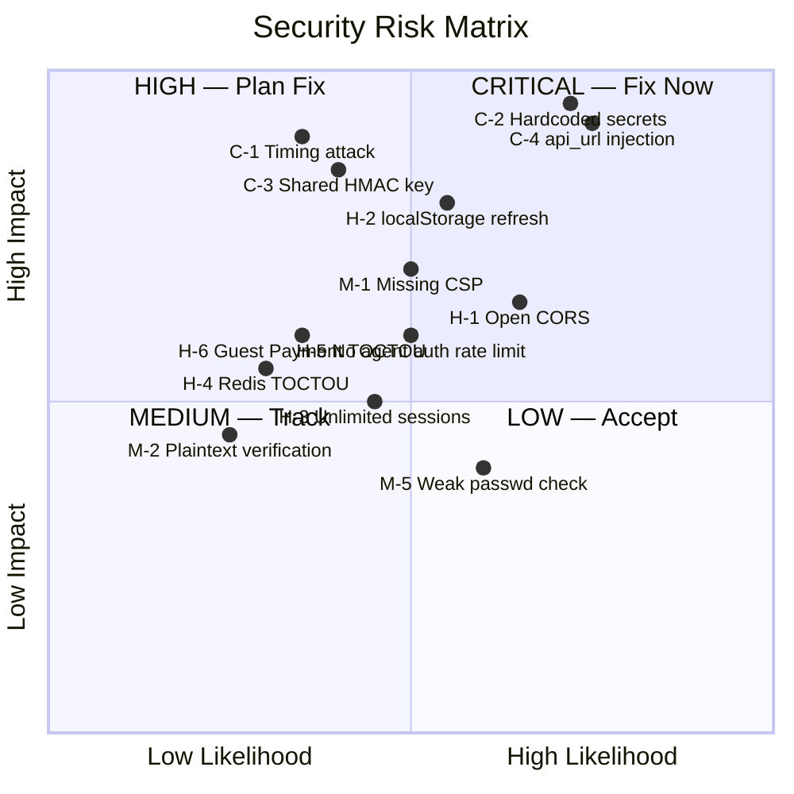

# 🔒 Security Audit Report v2 — BlindPass

**Date**: 2026-03-24  
**Remediation status updated through**: 2026-03-24 implementation pass
**Scope**: Full codebase review of `blindpass` — all packages and features through Phase 3D  
**Packages reviewed**: `sps-server`, `gateway`, `agent-skill`, `browser-ui`, `dashboard`, `openclaw-plugin`  
**Compared against**: [Security Audit v1 (2026-03-04)](file:///home/hvo/Projects/blindpass/docs/security/Security%20Audit.md)

### Related Documents

- [Threat Model](file:///home/hvo/Projects/blindpass/docs/security/blindpass-threat-model.md) — formal threat model with attacker capabilities, abuse paths, and threat table
- [Security Best Practices Supplement](file:///home/hvo/Projects/blindpass/docs/security/security_best_practices_report.md) — delta findings from targeted review (SBP-DELTA-001 elevated here as C-4; SBP-DELTA-002 on log hygiene)

---

## Executive Summary

Since the March 4 audit (v1), the BlindPass codebase has grown approximately 4× — adding user authentication, session management, RBAC, workspace policies, billing (Stripe + x402), guest secret exchange (public offers + intents), an agent enrollment system with API keys, and a full React SPA dashboard. Many v1 findings have been partially or fully addressed, but the expanded attack surface introduces significant new risks.

**Findings Summary**:

| Severity | Count | New since v1 |
|----------|-------|--------------|
| 🔴 Critical | 4 | 3 |
| 🟠 High | 6 | 4 |
| 🟡 Medium | 8 | 6 |
| 🔵 Low / Informational | 6 | 4 |
| **Total** | **24** | **17** |

### v1 Findings Status

| v1 Finding | Status |
|---|---|
| C-1: Non-constant-time HMAC comparison | ✅ **Fixed** — HMAC verification now uses constant-time comparison |
| C-2: Hardcoded HMAC fallback in prod | ✅ **Fixed** — runtime secret fallbacks removed; startup now fails closed |
| H-1: Redis `updateRequest` TOCTOU race | ❌ Still open, now also affects `updateApprovalRequest` |
| H-2: No rate limiting | ✅ **Fixed** — `RateLimitService` added for auth + public intents |
| H-3: Confirmation code low entropy | ❌ Still open (6,400 combinations) |
| H-4: CORS `origin: true` | ✅ Fixed — SPS now enforces an explicit browser-origin allowlist |
| M-1: Gateway `Math.random()` | ❌ Still open |
| M-2: No CSP header | ⚠️ Partially — CSP added, but dashboard production edge enforcement still needs confirmation |
| M-3: Static asset exposure | ✅ **Resolved** — UI decoupled |
| M-4: JWKS no TTL / revocation | ✅ **Fixed** — JWKS cache now has configurable TTL |
| M-5: Confirmation code binding | Unchanged (design limitation) |
| L-1: JWKS file permissions | Informational — unchanged |
| L-2: Audit log only to stdout | ⚠️ Changed — DB-backed audit exists; stdout leak path reduced, but `db=null` still means no durable audit |
| L-3: Missing security headers | ⚠️ Partially — browser-ui runtime covered; dashboard/SPS production headers still incomplete |
| L-4: `SecretStore.get()` defensive copy | ✅ Correct |
| L-5: `.gitignore` missing `gateway-key.json` | ❌ Still open |

### Implementation Status Update (2026-03-24)

| Finding | Status | Notes |
|---|---|---|
| C-1: Constant-time HMAC comparison | ✅ Done | HMAC verification now uses `timingSafeEqual()` with explicit length handling |
| C-2: Fail-fast for missing secrets in production | ✅ Done | `buildApp()` now requires HMAC/user/agent secrets; token helpers fail closed |
| C-3: Separate signing keys per token type | ✅ Done | Browser sigs, agent fulfillment, guest fulfillment, and guest access now use distinct derived signing keys |
| C-4: Remove `api_url` from browser-ui query parsing | ✅ Done | Query-controlled API origin removed; browser-ui now pins to configured origin |
| H-1: Restrict CORS origins | ✅ Done | SPS now allows only configured first-party origins, with loopback-only dev fallback |
| H-2: Move refresh token to httpOnly cookie | ⚠️ Partial | Moved from `localStorage` to `sessionStorage`; still JS-readable |
| H-3: Session count limit + invalidate on password change | ❌ Open | No global session cap or password-change-wide revocation |
| H-4: Atomic Redis `updateRequest` + `updateApproval` | ❌ Open | Non-atomic read/modify/write remains |
| H-5: Rate limit agent API key auth | ❌ Open | No repo-visible rate limiter on agent token minting path |
| H-6: Guest payment TOCTOU | ❌ Open | GET-then-INSERT race still present |
| M-1: Add CSP headers to both UIs | ⚠️ Partial | Browser-ui runtime nginx covered; dashboard has meta/dev-preview coverage, but edge headers still need confirmation |
| M-2: Hash verification tokens in DB | ❌ Open | Verification tokens still stored plaintext |
| M-3: Add verification token expiry | ❌ Open | No expiry field/check yet |
| M-4: x402 facilitator auth | ❌ Open | Facilitator responses still trusted by TLS only |
| M-5: Stronger password validation | ❌ Open | Minimum length remains the primary check |
| M-6: Add security headers (helmet / equivalent) | ⚠️ Partial | Browser-ui now sends several headers; dashboard/SPS production headers still incomplete and no HSTS |
| M-7: Fix `Math.random()` in gateway | ❌ Open | Gateway confirmation code generator still uses `Math.random()` |
| M-8: Guest subject hash design | ❌ Open | IP-based identity anchor still present |
| L-1: Update `.gitignore` | ❌ Open | Sensitive/generated files still need cleanup |
| L-2: Remove stale log files from repo | ❌ Open | Repo hygiene issue still needs cleanup |
| L-3: Redact sensitive runtime logs | ✅ Done | Live secret URLs and sensitive stdout records are now removed/redacted by default |
| L-4: Increase confirmation code entropy | ❌ Open | Human confirmation code space unchanged |
| L-5: Account-level lockout | ❌ Open | IP rate limiting only |
| L-6: Dashboard request timeouts | ❌ Open | No client-side request timeout added |

---

## 🔴 Critical Findings

### C-1: Non-Constant-Time HMAC Comparison (v1 — RESOLVED)

**Status (2026-03-24)**: ✅ Resolved.

**Files**:
- [crypto.ts](file:///home/hvo/Projects/blindpass/packages/sps-server/src/services/crypto.ts)
- [crypto.test.ts](file:///home/hvo/Projects/blindpass/packages/sps-server/tests/crypto.test.ts)
- [routes.test.ts](file:///home/hvo/Projects/blindpass/packages/sps-server/tests/routes.test.ts)
- [routes-adversarial.test.ts](file:///home/hvo/Projects/blindpass/packages/sps-server/tests/routes-adversarial.test.ts)

```typescript
return timingSafeEqual(Buffer.from(expected), Buffer.from(actual));
```

The original issue was a direct string comparison of HMAC values. Verification now uses constant-time comparison with explicit length checks before calling `timingSafeEqual()`.

The HMAC continues to protect:
- Secret request metadata + submit URLs  
- Fulfillment tokens for agent-to-agent exchange  
- Guest access tokens  
- Guest exchange fulfillment tokens  

**Residual note**: This closes the comparison side-channel. The remaining HMAC concern is now deployment quality: the derived signing domains still depend on one configured root secret, so weak root-secret choice or root-secret compromise would still have broad impact.

---

### C-2: Multiple Hardcoded JWT/HMAC Secret Fallbacks in Non-Production

**Status (2026-03-24)**: ✅ Resolved for current runtime code paths.

**Files**:
- [index.ts L79-L88](file:///home/hvo/Projects/blindpass/packages/sps-server/src/index.ts#L79): startup secret validation
- [index.ts L113](file:///home/hvo/Projects/blindpass/packages/sps-server/src/index.ts#L113): HMAC secret resolution
- [utils/crypto.ts L4-L6](file:///home/hvo/Projects/blindpass/packages/sps-server/src/utils/crypto.ts#L4): user JWT secret now required
- [agent.ts L64-L67](file:///home/hvo/Projects/blindpass/packages/sps-server/src/services/agent.ts#L64): agent JWT secret now required
- [secret-config.test.ts](file:///home/hvo/Projects/blindpass/packages/sps-server/tests/secret-config.test.ts): regression coverage
The original issue was that user JWT, agent JWT, and HMAC signing material silently fell back to repo-known defaults. That path has now been removed: startup fails closed outside test mode, and the token helpers themselves require configured secrets.

**Residual risk**:
1. The code does not currently enforce minimum entropy/length for configured user and agent JWT secrets.
2. The configured HMAC root secret still needs strong operator-managed entropy because it feeds multiple derived signing domains.

**Follow-up recommendation**:
1. Rotate any deployed secrets that may have existed before this fix
2. Add minimum entropy validation (for example, reject secrets shorter than 32 random bytes)
3. Consider multi-key rotation if independent rotation by token/signature class becomes a requirement

---

### C-3: Single Shared HMAC Secret for All Token Types (NEW)

**Status (2026-03-24)**: ✅ Resolved.

**File**: [crypto.ts](file:///home/hvo/Projects/blindpass/packages/sps-server/src/services/crypto.ts), [requester-auth.ts](file:///home/hvo/Projects/blindpass/packages/sps-server/src/services/requester-auth.ts)

The original issue was that one shared HMAC secret directly signed:
1. Browser URL metadata/submit signatures
2. Fulfillment tokens for A2A exchange
3. Guest access tokens
4. Guest exchange fulfillment tokens

The implementation now derives distinct signing domains from the configured root secret:
1. Browser request signatures
2. Agent fulfillment tokens
3. Guest fulfillment tokens
4. Guest access tokens

This keeps configuration surface low while isolating token classes so one derived key does not directly validate another token type.

**Residual note**:
1. The system still depends on one configured root secret, so weak root-secret choice remains a deployment concern.
2. Rotation still rolls all derived domains together unless multi-key rotation is introduced later.

---

### C-4: Browser UI Trusts User-Controlled `api_url` Query Parameter (NEW)

**Status (2026-03-24)**: ✅ Resolved.

**Files**:
- [request-context.js](file:///home/hvo/Projects/blindpass/packages/browser-ui/src/request-context.js)
- [app.js](file:///home/hvo/Projects/blindpass/packages/browser-ui/src/app.js)
- [request-context.test.mjs](file:///home/hvo/Projects/blindpass/packages/browser-ui/tests/request-context.test.mjs)
- [vite.config.ts](file:///home/hvo/Projects/blindpass/packages/browser-ui/vite.config.ts)

The original issue was that the browser UI read `api_url` directly from the query string and used it for metadata fetches, secret submission, and refresh. That query-controlled origin has now been removed from parsing and preview-link generation. The UI now uses only the configured API origin.

**Implemented**:
1. `api_url` removed from query parsing
2. preview-link generation strips `api_url`
3. browser-ui now pins to `VITE_SPS_API_URL` or the local default
4. CSP `connect-src` constraints were added to browser-ui runtime/dev configurations

**Residual follow-up**:
1. Keep regression coverage in place so `api_url` is not reintroduced
2. Consider signing the UI/API origin relationship server-side if multiple official origins are ever required

> [!CAUTION]
> This was the most immediately exploitable finding in the original audit. The direct exploit path reviewed here is now closed.

*Cross-reference: [SBP-DELTA-001](file:///home/hvo/Projects/blindpass/docs/security/security_best_practices_report.md), [TM-002 / TM-003](file:///home/hvo/Projects/blindpass/docs/security/blindpass-threat-model.md)*

---

## 🟠 High Findings

### H-1: CORS `origin: true` Reflects Any Origin (v1)

**Status (2026-03-24)**: ✅ Resolved.

**Files**:
- [index.ts](file:///home/hvo/Projects/blindpass/packages/sps-server/src/index.ts)
- [cors.test.ts](file:///home/hvo/Projects/blindpass/packages/sps-server/tests/cors.test.ts)
- [.env.test.example](file:///home/hvo/Projects/blindpass/packages/sps-server/.env.test.example)
- [Unraid.md](file:///home/hvo/Projects/blindpass/docs/deployment/Unraid.md)

`origin: true` formerly reflected any requesting origin. With the addition of user authentication, the dashboard SPA, billing endpoints, and workspace admin APIs, the impact had become materially higher:
- Any malicious website can make authenticated API calls using the user's access token (if it can extract it from browser storage via XSS or another same-origin compromise)
- Billing operations, workspace member management, and policy changes are accessible cross-origin

The implementation now:
1. restricts browser origins to an explicit allowlist from `SPS_CORS_ALLOWED_ORIGINS` plus `SPS_UI_BASE_URL`
2. normalizes origin values before comparison
3. fails closed in production when no browser origin is configured
4. keeps non-production loopback origins available for local dashboard/browser-ui development

**Residual note**:
1. Deployments still need to keep `SPS_CORS_ALLOWED_ORIGINS` aligned with every first-party frontend origin
2. This closes arbitrary-origin reflection, but it does not reduce the separate risk of JS-readable refresh tokens on an already-compromised first-party origin

---

### H-2: Dashboard Stores Refresh Token in `localStorage` (NEW)

**Status (2026-03-24)**: ⚠️ Partially resolved.

**Files**:
- [AuthContext.tsx](file:///home/hvo/Projects/blindpass/packages/dashboard/src/auth/AuthContext.tsx)
- [auth-storage.js](file:///home/hvo/Projects/blindpass/packages/browser-ui/src/auth-storage.js)

```typescript
const REFRESH_TOKEN_KEY = "sps_refresh_token";
window.sessionStorage.setItem(REFRESH_TOKEN_KEY, token);
```

Refresh tokens no longer persist in `localStorage`. They now live in `sessionStorage`, which removes the durable cross-restart token exposure that originally amplified the issue. The direct `api_url` exfiltration chain is also closed by C-4.

However, the token remains JavaScript-readable on the first-party origin. Combined with XSS or a compromised dependency/extension, session theft remains possible.

**Current recommendation**:
1. Move refresh tokens to `HttpOnly` + `Secure` + `SameSite=Strict` cookies for full closure
2. Until then, treat this as reduced but not eliminated risk
3. Keep CSP/header hardening in place to reduce exploitability of any future XSS

---

### H-3: No Session Count Limit Per User (NEW)

**File**: [user.ts](file:///home/hvo/Projects/blindpass/packages/sps-server/src/services/user.ts#L392-L435)

The `createSessionAndTokens` function creates unlimited sessions per user. An attacker who obtains credentials can create an unbounded number of sessions, filling the `user_sessions` table and consuming DB resources.

More importantly: password change does **not** invalidate existing sessions. Only `forcePasswordChange` blocks the access token, but existing refresh tokens remain valid until they expire (7 days).

**Recommendation**:
1. Cap sessions per user (e.g., 10 concurrent)
2. On password change, revoke **all** other sessions
3. Add a "revoke all sessions" admin endpoint

---

### H-4: Redis `updateRequest` / `updateApprovalRequest` TOCTOU (v1 — EXPANDED)

**File**: [redis.ts L40-59, L272-295](file:///home/hvo/Projects/blindpass/packages/sps-server/src/services/redis.ts#L40-L59)

The v1 `updateRequest` TOCTOU issue remains unfixed and now also applies to `updateApprovalRequest`. Both perform GET → modify → SET without atomicity. While exchange operations correctly use Lua scripts, the approval workflow is vulnerable to race conditions where two concurrent approval decisions could corrupt state.

**Recommendation**: Wrap in Lua scripts (as done for `reserveExchange`, `submitExchange`, etc.).

---

### H-5: Agent API Key Authentication Not Rate-Limited (NEW)

**File**: [agents.ts route](file:///home/hvo/Projects/blindpass/packages/sps-server/src/routes/agents.ts)

The `POST /api/v2/agents/authenticate` endpoint accepts an API key and returns a JWT. While bcrypt's cost factor provides some inherent resistance to brute force, there is no rate limiting on API key authentication attempts. The API key format (`ak_{uuid}_{random}`) reveals the agent row ID, enabling targeted offline enumeration.

**Recommendation**: Add rate limiting per IP on the `/authenticate` endpoint. Avoid exposing the agent row ID in the API key prefix if possible.

---

### H-6: `verifyAndSettleGuestPayment` TOCTOU Race Condition (NEW)

**File**: [guest-payment.ts](file:///home/hvo/Projects/blindpass/packages/sps-server/src/services/guest-payment.ts#L230-L248)

The `verifyAndSettleGuestPayment` function checks for an existing payment outside of a transaction:
```typescript
const existing = await findGuestPaymentByPaymentId(db, input.workspaceId, input.paymentId);
// ...
await insertPendingGuestPayment(db, { ... });
```
This GET-then-INSERT pattern is not atomic. While `insertPendingGuestPayment` uses `ON CONFLICT DO NOTHING`, two concurrent requests can both see `existing = null`, one inserts successfully, the other does nothing, but **both** proceed to execute `provider.verifyPayment` and `provider.settlePayment`. This could lead to duplicate settlement requests to the facilitator.

**Recommendation**: Use a database transaction and rely on the result of a conditional `INSERT ... RETURNING *` or an atomic locking mechanism to ensure only one request proceeds to the provider.

---

## 🟡 Medium Findings

### M-1: No CSP Header on Browser UI or Dashboard (v1 — EXPANDED)

**Status (2026-03-24)**: ⚠️ Partially resolved.

**Files**: [browser-ui/index.html](file:///home/hvo/Projects/blindpass/packages/browser-ui/index.html), [dashboard/index.html](file:///home/hvo/Projects/blindpass/packages/dashboard/index.html)

Both frontends now have CSP coverage in repo-visible code, but not all deployment paths are equally strong:

- Browser UI:
  - CSP header in runtime nginx config
  - CSP meta fallback in HTML
  - CSP headers in Vite dev/preview
- Dashboard:
  - CSP meta fallback in HTML
  - CSP headers in Vite dev/preview
  - production edge/header enforcement is still not visible in repo

**Remaining recommendation**:
1. Ensure the dashboard production host emits CSP as an HTTP response header
2. Tighten `connect-src` to exact deployed API origins rather than broad protocol allowances
3. Add reporting if you want runtime visibility into CSP violations

---

### M-2: Verification Token Stored as Plaintext in DB (NEW)

**File**: [user.ts L174-175](file:///home/hvo/Projects/blindpass/packages/sps-server/src/services/user.ts#L173-L178)

Email verification tokens are stored in the `users.verification_token` column as plaintext strings. The `hashToken` function exists and is used for refresh tokens, but verification tokens bypass it.

An attacker with read-only DB access (e.g., SQL injection, backup leak) can directly verify any user's email.

**Recommendation**: Store `hashToken(verificationToken)` in the DB and compare against the hash on verification.

---

### M-3: Email Verification Does Not Expire (NEW)

**File**: [user.ts L757-800](file:///home/hvo/Projects/blindpass/packages/sps-server/src/services/user.ts#L757-L800)

The `verifyEmail` function checks only that the token matches — there is no expiry. A verification token issued during registration remains valid indefinitely.

**Recommendation**: Add a `verification_token_expires_at` column or use a JWT with expiry for the verification token.

---

### M-4: No Webhook Signature Validation for x402/Facilitator Responses (NEW)

**File**: [x402.ts L475-543](file:///home/hvo/Projects/blindpass/packages/sps-server/src/services/x402.ts#L475-L543)

The `HttpX402Provider` calls the facilitator's `/verify` and `/settle` endpoints without authenticating the facilitator's identity. It trusts the response bodies at face value:

```typescript
const response = await fetch(`${this.facilitatorUrl}/verify`, { ... });
return { valid: response.isValid, ... };
```

A DNS hijack or MITM on the facilitator URL could make the SPS believe any payment is valid.

**Recommendation**: Pin the facilitator's TLS certificate or use HMAC-authenticated requests.

---

### M-5: Password Strength Validation Is Minimal (NEW)

**File**: [user.ts L139-145](file:///home/hvo/Projects/blindpass/packages/sps-server/src/services/user.ts#L139-L145)

Password validation only checks minimum length (8 chars). No checks for:
- Common password lists (beyond the 4 weak temporary passwords)
- Entropy or character diversity requirements
- Passwords matching the email address

**Recommendation**: Integrate a password strength checker (e.g., zxcvbn) or at minimum block the top 10,000 most common passwords.

---

### M-6: Missing `X-Frame-Options`, `HSTS`, and Security Headers (v1 — EXPANDED)

**Status (2026-03-24)**: ⚠️ Partially resolved.

**File**: [index.ts L99-102](file:///home/hvo/Projects/blindpass/packages/sps-server/src/index.ts#L99-L102)

The browser-ui runtime now sends:
- `X-Content-Type-Options: nosniff`
- `X-Frame-Options: DENY`
- `Permissions-Policy`
- `Referrer-Policy`
- CSP

The dashboard now has dev/preview header coverage plus a frame-busting guard in app code. The SPS API still only sets `Referrer-Policy`, and no repo-visible production HSTS/header layer exists for the dashboard.

The remaining recommended headers are still missing or unverified on all production surfaces:
- `X-Content-Type-Options: nosniff`
- `X-Frame-Options: DENY`
- `Strict-Transport-Security` (HSTS)
- `Permissions-Policy`

**Recommendation**:
1. Add response headers at the actual dashboard production edge
2. Add `helmet` or equivalent headers on the SPS API
3. Add HSTS only once HTTPS termination behavior is confirmed across environments

---

### M-7: Gateway `Math.random()` for Confirmation Codes (v1 — STILL OPEN)

**File**: [code-generator.ts](file:///home/hvo/Projects/blindpass/packages/gateway/src/code-generator.ts)

Unchanged from v1. The gateway-side code generator uses `Math.random()` instead of `crypto.randomBytes()`.

---

### M-8: Guest Subject Hash Uses IP Address as Identity Anchor (NEW)

**File**: [guest-intent.ts L313-315](file:///home/hvo/Projects/blindpass/packages/sps-server/src/services/guest-intent.ts#L313-L315)

```typescript
function buildGuestSubjectHash(sourceIp: string, requesterPublicKey: string, ...): string {
  return hashValue(`${sourceIp}:${actorType}:${requesterPublicKey}`);
}
```

IP addresses are unreliable identifiers — they can be spoofed, shared (NAT), or rotate (mobile). An attacker behind the same NAT as a legitimate guest user could potentially resume or interfere with another user's intent.

**Recommendation**: Use a stronger identity anchor or require explicit session binding.

---

## 🔵 Low / Informational Findings

### L-1: `.gitignore` Missing `gateway-key.json` (v1 — STILL OPEN)

**File**: [.gitignore](file:///home/hvo/Projects/blindpass/.gitignore)

Still not excluding `gateway-key.json` or `jwks.json`. Also not excluding the numerous `*.log` files in the root directory (`sps.log`, `payer-output*.log`, `test-output*.log`).

> [!NOTE]
> The `*.log` pattern was added, but several `.log` files appear to already be tracked.

---

### L-2: Stale Log Files Committed to Repository (NEW)

**Root directory** contains several log files that may contain sensitive operational data:
- `sps.log`, `payer-output.log`, `test-output.log`, `test-output-final-v3.log`, etc.

These should be removed from tracking and added to `.gitignore`.

---

### L-3: Sensitive Data in Logs / Audit Still Console-Based (v1 — EXPANDED)

**Status (2026-03-24)**: ✅ Resolved for the sensitive-stdout leak path described here.

The original stdout leak paths have now been removed or gated:
- OpenClaw no longer logs live `secretUrl` values
- `logAudit()` emits only a redacted summary, and only when `SPS_LOG_AUDIT_EVENTS=1`
- verification URLs are opt-in behind `SPS_LOG_VERIFICATION_URLS=1`
- leftover debug logging in user services was removed

**Remaining note**: if `db` is null, audit durability is still reduced, but the specific sensitive-data leak documented here is no longer present by default.

*Cross-reference: [SBP-DELTA-002](file:///home/hvo/Projects/blindpass/docs/security/security_best_practices_report.md), [TM-004](file:///home/hvo/Projects/blindpass/docs/security/blindpass-threat-model.md)*

---

### L-4: Confirmation Code Entropy Still 12.6 Bits (v1 — STILL OPEN)

6,400 possible values. While this is a human-readability aid, with guest secret exchange now public-facing, the social engineering risk is higher.

---

### L-5: No Account Lockout After Failed Login Attempts (NEW)

Rate limiting is applied per-IP for login attempts (10/min), but there is no account-level lockout. An attacker using a botnet or distributed proxies can attempt unlimited passwords against a target account.

**Recommendation**: Add progressive delays or temporary lockout (e.g., 15-minute lock after 20 failed attempts) at the account level.

---

### L-6: Dashboard API Client Lacks Request Timeouts (NEW)

**File**: [client.ts](file:///home/hvo/Projects/blindpass/packages/dashboard/src/api/client.ts#L66-L101)

The `apiRequest` function uses `fetch()` without an `AbortController` timeout. A slow or unresponsive API server could cause the dashboard to hang indefinitely.

---

## ✅ Positive Security Findings (New Since v1)

| Area | Assessment |
|------|------------|
| **Rate Limiting** | Added `RateLimitService` (Redis + in-memory) for auth, registration, and public intents ✅ |
| **JWKS Cache TTL** | JWKS now has configurable cache expiry (default 60s) ✅ |
| **Multi-Provider Auth** | JWKS supports multiple auth providers with per-provider issuer/audience ✅ |
| **SPIFFE Support** | Workload identity validation with SPIFFE ID mismatch detection ✅ |
| **RBAC** | Role hierarchy (`viewer` < `operator` < `admin`) with `checkPermission` ✅ |
| **Session Management** | Refresh token rotation, session revocation via `revoked_at` ✅ |
| **Password Hashing** | bcrypt with 12 rounds for users and agent API keys ✅ |
| **Refresh Token Hashing** | Stored as SHA-256 hash, not plaintext ✅ |
| **Workspace Access Control** | `enforceActiveAccess` blocks suspended/deleted workspaces ✅ |
| **Force Password Change** | Blocks API access (except auth) when `fpc=true` ✅ |
| **Atomic Exchange Operations** | `reserveExchange`, `submitExchange`, `atomicRetrieveExchange` all use Lua scripts ✅ |
| **Workspace Isolation** | Hosted mode enforces `workspace_id` claim in all agent tokens ✅ |
| **Audit Trail** | DB-backed audit log with automatic retention cleanup ✅ |
| **Billing Webhook Auth** | Stripe `constructEvent` validates webhook signatures ✅ |
| **x402 Payment Validation** | Quote/payment matching with network, asset, amount verification ✅ |
| **Guest Intent Rate Limiting** | Per-IP and per-offer rate limits on public intent creation ✅ |
| **Input Validation** | AJV schemas on all endpoints with `additionalProperties: false` ✅ |
| **Agent API Key Design** | Prefix-based routing avoids table scan; bcrypt hashing for comparison ✅ |
| **Guest Access Tokens** | Scoped JWT tokens with intent-specific claims and expiry ✅ |

---

## Risk Assessment Matrix



---

## Recommended Prioritization

| Priority | Finding | Effort | Impact | Status |
|----------|---------|--------|--------|--------|
| **P0** | C-1: Constant-time HMAC comparison | Low | Closes timing side-channel | ✅ Done |
| **P0** | C-2: Fail-fast for missing secrets in production | Low | Prevents catastrophic misconfiguration | ✅ Done |
| **P0** | C-3: Separate signing keys per token type | Medium | Key compromise isolation | ✅ Done |
| **P0** | C-4: Remove `api_url` from browser-ui query parsing | Low | Eliminates zero-click phishing primitive | ✅ Done |
| **P1** | H-1: Restrict CORS origins | Low | Prevents cross-origin API abuse | ✅ Done |
| **P1** | H-2: Move refresh token to httpOnly cookie | Medium | Prevents XSS-based token theft | ⚠️ Partial |
| **P1** | M-1: Add CSP headers to both UIs | Low | XSS mitigation | ⚠️ Partial |
| **P1** | H-5: Rate limit agent API key auth | Low | Prevents key brute-force | ❌ Open |
| **P1** | H-6: Guest payment TOCTOU | Medium | Prevents duplicate settlements | ❌ Open |
| **P2** | H-3: Session count limit + invalidate on password change | Medium | Account takeover mitigation | ❌ Open |
| **P2** | H-4: Atomic Redis `updateRequest` + `updateApproval` | Medium | Race condition fix | ❌ Open |
| **P2** | M-2: Hash verification tokens in DB | Low | Defense-in-depth | ❌ Open |
| **P2** | M-3: Add verification token expiry | Low | Limits token lifetime | ❌ Open |
| **P2** | M-5: Stronger password validation | Low | Credential strength | ❌ Open |
| **P2** | M-6: Add security headers (helmet) | Low | Clickjacking/MIME prevention | ⚠️ Partial |
| **P2** | M-4: x402 facilitator auth | Medium | Payment integrity | ❌ Open |
| **P3** | M-7: Fix `Math.random()` in gateway | Low | PRNG correctness | ❌ Open |
| **P3** | M-8: Guest subject hash design | Medium | Identity binding | ❌ Open |
| **P3** | L-1: Update `.gitignore` | Low | Prevent key leaks | ❌ Open |
| **P3** | L-2: Remove stale log files from repo | Low | Hygiene | ❌ Open |
| **P3** | L-4: Increase confirmation code entropy | Low | Social engineering | ❌ Open |
| **P3** | L-5: Account-level lockout | Medium | Distributed brute-force | ❌ Open |
| **P3** | L-6: Dashboard request timeouts | Low | UX resilience | ❌ Open |

---

## Threat Model Summary

### Threat Actors

| Actor | Motivation | Access Level |
|-------|-----------|-------------|
| **External attacker** | Data theft, account takeover | Network access to public endpoints |
| **Malicious guest** | Secret exfiltration, free resource abuse | Public offer tokens |
| **Compromised agent** | Lateral escalation, secret theft | Valid agent JWT |
| **Insider (DB read)** | Credential theft | Read access to PostgreSQL |
| **MITM (facilitator)** | Payment fraud | Network between SPS and facilitator |

### Key Attack Chains

1. **XSS → Session token theft → Account takeover (H-2 + M-1 + H-1)**: Refresh tokens are still JS-readable in `sessionStorage`; a dashboard-origin XSS can still steal them even though persistence is reduced.
2. **First-party origin compromise → API abuse from an allowed frontend (Residual H-1/H-2)**: Arbitrary-origin reflection is gone, but a compromised allowed frontend origin can still abuse API reach while refresh tokens remain JS-readable.
3. **Facilitator MITM → Free paid exchanges (M-4)**: Hijacking the x402 facilitator URL lets an attacker claim payments are valid without actual payment.
4. **Race condition → Duplicate settlement (H-6)**: Concurrent guest payment requests both pass the existence check and both call `provider.settlePayment`, causing double-spend on the facilitator.
5. **Race condition → Policy bypass (H-4)**: TOCTOU in `updateApprovalRequest` could let an already-rejected approval be re-approved under concurrent load.
6. **Root HMAC compromise → Derived-key compromise blast radius (Residual C-3 note)**: Direct token-class key reuse has been removed, but compromise of the configured root secret would still affect all derived signing domains until per-domain rotation is introduced.

---

*This audit covers the codebase as of 2026-03-24. A follow-up audit should be conducted after addressing P0/P1 items and before production launch.*
