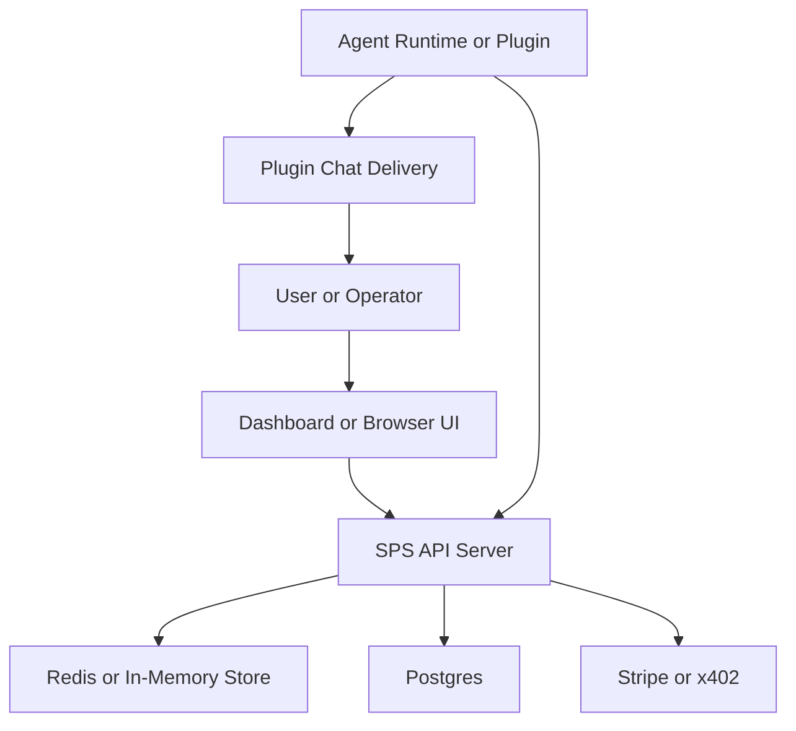

# BlindPass Threat Model

### Related Documents

- [Security Audit v2](../../docs/security/Security%20Audit%20v2.md) — canonical audit report with 24 findings and prioritized remediation plan
- [Security Best Practices Supplement](../../docs/security/security_best_practices_report.md) — delta findings on `api_url` injection (TM-002/TM-003) and log leak (TM-004)

Assumptions used for this review because no deployment-specific clarifications were provided:

- Risk ranking assumes the hosted, internet-facing deployment described in `README.md` is in scope, not just local development.
- `packages/sps-server`, `packages/browser-ui`, `packages/dashboard`, `packages/gateway`, `packages/agent-skill`, and `packages/openclaw-plugin` are in scope.
- Redis/Postgres/Stripe/x402 infrastructure is treated as normal managed dependencies; infra-specific ACLs and edge headers are not visible in this repo.
- The most sensitive assets are user credentials, agent credentials, signing secrets, one-time fulfillment links/tokens, and plaintext secrets at browser/agent endpoints.
- Repo-visible browser hardening now exists:
  - browser-ui has CSP and security headers in nginx plus Vite dev/preview config
  - dashboard has CSP meta fallback plus Vite dev/preview headers
  - dashboard production edge headers are still not visible in repo

Open questions that would materially change ranking:

- Are `SPS_USER_JWT_SECRET`, `SPS_AGENT_JWT_SECRET`, and `SPS_HMAC_SECRET` guaranteed by deployment and rotated after the fail-closed secret change?
- Are dashboard production security headers enforced at the actual hosting edge?
- Are log sinks for the SPS server and OpenClaw plugin accessible to support staff, customers, or shared observability platforms?

## Executive summary

The initial highest-risk themes were auth material misuse and official-origin phishing. The direct exploit paths for missing runtime signing secrets, query-controlled browser-ui API origin, live-link stdout leakage, arbitrary-origin CORS reflection, and the guest-payment settlement race have since been mitigated in code. The highest remaining themes are browser-session theft through any future frontend compromise, facilitator/payment trust, and incomplete production header coverage on all surfaces.

## Status update since initial model

- TM-001: materially reduced. SPS startup and token helpers now fail closed on missing HMAC/user/agent signing secrets.
- TM-002: resolved for the reviewed code paths. Browser-ui no longer honors query-supplied `api_url`.
- TM-003: reduced, not eliminated. Refresh tokens moved from `localStorage` to `sessionStorage`, and the `api_url` exfiltration path was removed, but tokens remain JS-readable.
- TM-004: direct sensitive-stdout leak path resolved. Live secret URLs and verbose audit/verification logs are removed or gated behind explicit opt-in flags.
- TM-006: reduced. CSP, clickjacking protections, and inline-handler removal improve frontend posture, but production dashboard edge headers are still not confirmed and refresh tokens are not yet cookie-backed.

## Scope and assumptions

- In-scope paths:
  - `packages/sps-server`
  - `packages/browser-ui`
  - `packages/dashboard`
  - `packages/gateway`
  - `packages/agent-skill`
  - `packages/openclaw-plugin`
- Out of scope:
  - External SaaS control planes, DNS/TLS/CDN settings, runtime Kubernetes/container security, and actual Stripe/x402 account configuration.
  - CI/CD hardening beyond what is directly visible in repo files.
- Explicit assumptions:
  - Hosted SPS APIs and static frontends are reachable from the internet.
  - Operators rely on the browser UI and dashboard for real credential exchange.
  - Agent plugins may run in semi-trusted environments where stdout/stderr is collected centrally.
- Open questions:
  - Whether production injects strict browser security headers at the edge.
  - Whether OpenClaw plugin logs are considered trusted-only.
  - Whether self-hosted/internal-only deployments are a primary target instead of hosted multi-workspace service.

## System model

### Primary components

- SPS API server: Fastify app that exposes auth, secret request/retrieval, exchange, billing, audit, public offers, and guest intent routes. Evidence: `packages/sps-server/src/index.ts`, `packages/sps-server/src/routes/*.ts`.
- Browser UI: Static Vite app that reads signed request context from the URL, fetches metadata, encrypts secrets client-side, and submits ciphertext. Evidence: `packages/browser-ui/src/app.js`, `packages/browser-ui/src/request-context.js`.
- Dashboard: React SPA for workspace auth, agent/member management, billing, policy, audit, and public offers. Evidence: `packages/dashboard/src/auth/AuthContext.tsx`, `packages/dashboard/src/pages/*.tsx`.
- Agent/gateway runtime: Agent-side secret store plus gateway/plugin clients that mint/request tokens, create requests, fulfill exchanges, and deliver secure links. Evidence: `packages/agent-skill/src/*.ts`, `packages/gateway/src/*.ts`, `packages/openclaw-plugin/*.mjs`.
- Data stores: Redis or in-memory request/exchange store and Postgres for hosted data, users, billing, offers, audit, and agents. Evidence: `packages/sps-server/src/index.ts`, `packages/sps-server/src/services/redis.ts`, `packages/sps-server/src/db/migrations/*.sql`.
- Billing/x402 integrations: Stripe checkout/webhooks and x402 quote/payment verification. Evidence: `packages/sps-server/src/routes/billing.ts`, `packages/sps-server/src/services/billing.ts`, `packages/sps-server/src/services/x402.ts`.

### Data flows and trust boundaries

- Internet user/operator -> Dashboard or Browser UI
  - Data: credentials, refresh tokens, secret plaintext, one-time links, query parameters.
  - Channel: browser HTTPS to static frontend.
  - Guarantees: browser-ui now has repo-visible CSP/security headers; dashboard has repo-visible CSP meta fallback and dev/preview headers, but production edge enforcement is still not confirmed.
  - Validation: frontend form checks; server-side schemas on API side.
- Dashboard/Browser UI -> SPS API
  - Data: user bearer tokens, refresh tokens, signed request IDs, ciphertext payloads, public-offer tokens.
  - Channel: HTTP fetch.
  - Guarantees: bearer-token auth or signed query parameters; no cookie-based CSRF visible.
  - Validation: Fastify schemas on most routes, JWT verification, HMAC verification, route-specific authz.
- Agent runtime/plugin/gateway -> SPS API
  - Data: agent JWTs, agent API keys, HPKE public keys, fulfillment tokens, ciphertext, payment headers.
  - Channel: HTTP fetch.
  - Guarantees: workload JWT verification or API-key exchange, workspace checks in hosted mode, rate limits on some entry points.
  - Validation: schema validation, workspace matching, policy/approval checks, one-time retrieval semantics.
- SPS API -> Redis/Postgres
  - Data: ciphertext, exchange lifecycle state, API key hashes, refresh-token hashes, audit records, billing records.
  - Channel: Redis/Postgres client connections.
  - Guarantees: app-level object matching and hashed persistence for refresh/API keys.
  - Validation: SQL constraints, Redis Lua scripts, service-layer checks.
- SPS API -> Stripe/x402 providers
  - Data: billing identifiers, webhook payloads, quote/payment verification payloads.
  - Channel: HTTPS and signed webhook POSTs.
  - Guarantees: provider-specific signature validation for webhooks; x402 quote/payment verification.
  - Validation: provider SDK verification and request-hash matching.
- Plugin -> external chat transport
  - Data: secret URLs and confirmation codes.
  - Channel: chat API / runtime / CLI / Telegram fallback.
  - Guarantees: transport-specific only; no BlindPass-side confidentiality once message is emitted.
  - Validation: minimal routing validation on channel parameters.

#### Diagram

## Assets and security objectives

| Asset | Why it matters | Security objective (C/I/A) |
| --- | --- | --- |
| Plaintext secrets at browser/agent edge | Core product promise is that secrets never leak to the wrong party | C |
| User access and refresh tokens | Control dashboard, billing, agents, policy, audit, and offers | C/I |
| Agent access tokens and API keys | Control secret request/retrieval and exchange fulfillment | C/I |
| SPS signing secrets (`SPS_USER_JWT_SECRET`, `SPS_AGENT_JWT_SECRET`, `SPS_HMAC_SECRET`) | Root of trust for user auth, agent auth, request signatures, and fulfillment tokens | C/I |
| One-time secret URLs, guest access tokens, fulfillment tokens | Grant short-lived access to request metadata and exchange flows | C/I |
| Workspace policy and authorization state | Governs who can request or fulfill which secrets | I |
| Audit logs and operational metadata | Needed for investigation; also reveal sensitive workflow details | C/I |
| Billing and quota state | Enforces commercial limits and payment-backed flows | I/A |
| Redis/Postgres availability | Secret exchange and hosted management depend on these stores | A |

## Attacker model

### Capabilities

- Remote attacker can reach public HTTP endpoints and static frontends.
- Attacker can craft arbitrary URLs and send convincing links to users/operators.
- Attacker can read repo source and learn built-in fallback secret values.
- Attacker can sign up as a guest requester through public offers if they obtain an offer token.
- Attacker may gain access to centralized logs or support tooling in realistic insider or observability-compromise scenarios.

### Non-capabilities

- Attacker does not break HPKE primitives or TLS by default.
- Attacker does not automatically have agent runtime memory or local browser storage on BlindPass origins without another bug or social-engineering step.
- Attacker does not automatically control Stripe/x402 providers or Postgres/Redis infrastructure.

## Entry points and attack surfaces

| Surface | How reached | Trust boundary | Notes | Evidence (repo path / symbol) |
| --- | --- | --- | --- | --- |
| User auth API | Browser or script -> `/api/v2/auth/*` | Internet -> SPS API | Returns bearer and refresh tokens | `packages/sps-server/src/routes/auth.ts` |
| Agent token exchange | Agent API key -> `/api/v2/agents/token` | Agent/plugin -> SPS API | Mints SPS agent bearer tokens | `packages/sps-server/src/routes/agents.ts` |
| Secret request/retrieve API | Agent bearer token -> `/api/v2/secret/*` | Agent/plugin -> SPS API | Core secret handoff path | `packages/sps-server/src/routes/secrets.ts` |
| Exchange API | Agent bearer token + fulfillment tokens | Agent/plugin -> SPS API | Agent-to-agent handoff with approval/payment hooks | `packages/sps-server/src/routes/exchange.ts` |
| Public intent API | Anonymous guest -> `/api/v2/public/intents` | Internet -> SPS API | Guest request/pay/activate flows | `packages/sps-server/src/routes/public-intents.ts` |
| Browser UI query params | Official secret page URL | Internet -> Browser UI | Parses only signed request identifiers plus preview flags | `packages/browser-ui/src/request-context.js` |
| Dashboard session persistence | First-party SPA storage/refresh | Browser -> Dashboard/API | Refresh token kept in `sessionStorage` pending cookie migration | `packages/dashboard/src/auth/AuthContext.tsx` |
| Plugin chat delivery | Runtime -> chat channel | Agent/plugin -> external channel | Delivers one-time links to humans | `packages/openclaw-plugin/index.mjs` |
| Billing webhook | Provider -> `/api/v2/webhook/stripe` | Stripe -> SPS API | Signature-verified raw payload handling | `packages/sps-server/src/routes/billing.ts` |

## Top abuse paths

1. Attacker lands XSS or same-origin script execution on a BlindPass frontend origin, reads JS-accessible refresh tokens from `sessionStorage`, and mints new access tokens.
2. Attacker compromises an allowed first-party frontend origin and uses its existing API reach together with JS-readable refresh tokens to persist access.
3. Attacker or insider with log access attempts to recover sensitive workflow data; current code now redacts/gates the main stdout leak paths, reducing but not eliminating the sensitivity of log sinks.
4. Attacker abuses public offer tokens to create high-volume guest intents, spamming operator approval queues or exhausting rate limits/quotas even if secret disclosure is blocked.
5. Attacker exploits facilitator trust weaknesses to obtain fraudulent payment acceptance even though duplicate guest settlement races are now blocked locally.

## Threat model table

| Threat ID | Threat source | Prerequisites | Threat action | Impact | Impacted assets | Existing controls (evidence) | Gaps | Recommended mitigations | Detection ideas | Likelihood | Impact severity | Priority |
| --- | --- | --- | --- | --- | --- | --- | --- | --- | --- | --- | --- | --- |
| TM-001 | Remote attacker | Deployment omits or misconfigures signing env vars | Abuse missing signing material to forge user, agent, guest, or fulfillment tokens | Full workspace takeover, agent impersonation, forged secret/exchange actions | User tokens, agent tokens, signing secrets, policies, billing, secrets | Startup and token helpers now fail closed on required secrets: `packages/sps-server/src/index.ts`, `packages/sps-server/src/utils/crypto.ts`, `packages/sps-server/src/services/agent.ts` | Residual risk is mostly deployment regression or reuse of weak configured secrets | Keep fail-closed startup checks, add minimum-entropy validation, rotate any legacy secrets | Alert on startup with unset/weak secrets; monitor auth anomalies across many workspaces | Low | High | medium |
| TM-002 | Remote attacker using social engineering | User opens crafted official-origin browser-ui link | Attempt to override API origin and receive encrypted secret | Historical direct disclosure of plaintext-equivalent secrets entered by the user | Plaintext secrets, user trust, one-time handoff integrity | Browser UI no longer accepts query-supplied API origins: `packages/browser-ui/src/request-context.js`, `packages/browser-ui/src/app.js` | Residual risk would require regression or a different origin-confusion bug | Keep regression tests; if multiple official origins are introduced, bind/sign them explicitly | Alert on unexpected API origin changes in browser telemetry if added later | Low | High | low |
| TM-003 | Remote attacker or same-origin script compromise | Victim has refresh token stored for same origin | Read JS-accessible refresh token and replay it for new access tokens | Session hijack and durable dashboard/browser-ui access | Refresh tokens, user account access | `api_url` exfiltration path removed and refresh tokens moved to `sessionStorage` | Refresh tokens remain JS-readable because they are not yet `HttpOnly` cookies | Move refresh tokens to cookies; keep origin pinning and browser hardening | Detect anomalous refresh patterns and repeated token rotation from new networks | Medium | High | high |
| TM-004 | Insider or attacker with log access | Access to container/stdout/observability logs | Read sensitive workflow metadata from logs | Leak operational metadata or live sessions during TTL windows | Secret URLs, audit data, request/exchange metadata | Plugin URL logging removed; audit/verification logs redacted or opt-in: `packages/openclaw-plugin/index.mjs`, `packages/sps-server/src/services/audit.ts`, `packages/sps-server/src/services/user.ts` | Log sinks still contain some operational metadata and remain sensitive | Keep redaction tests; restrict retention/access; monitor for token-shaped strings in logs | Medium | Medium | low |
| TM-005 | Anonymous guest or botnet | Valid public offer token or repeated access to public endpoints | Flood public intent creation and approval/payment workflows | Operator fatigue, quota exhaustion, availability degradation | Quotas, approval workflow, operational availability | Per-IP and per-offer rate limits plus payment/approval states: `packages/sps-server/src/routes/public-intents.ts`, `packages/sps-server/src/middleware/rate-limit.ts` | Limits are simple counters; no CAPTCHA or stronger abuse screening visible | Add stronger abuse controls for public offers, anomaly detection, optional CAPTCHA or proof-of-work for guest flows | Monitor spikes per offer/workspace/IP; alert on repeated throttling | Medium | Medium | medium |
| TM-006 | XSS or third-party script compromise on first-party origin | A future frontend injection bug, compromised dependency, or extension on BlindPass origin | Read JS-accessible refresh token and replay it | Account takeover after any frontend compromise | Refresh tokens, user sessions | CSP and frame protections were added; inline browser-ui handler removed; obvious raw HTML sinks were not found | Refresh tokens are still JS-readable and dashboard production edge headers are not yet verified | Move refresh tokens to cookies; enforce dashboard production headers at the edge; consider CSP reporting | Monitor token refreshes after frontend errors or CSP violations | Low | High | medium |
| TM-007 | Remote attacker or compromised facilitator path | Valid public offer token and payment capability, plus ability to spoof or subvert facilitator trust | Trick SPS into accepting or settling a payment that was not actually valid | Fraudulent guest activation or payment accounting errors | Payment integrity, billing state, facilitator trust | Guest payment processing now gates provider calls on the winner of an atomic pending-row insert in `packages/sps-server/src/services/guest-payment.ts`; duplicate local settlement races are blocked | Facilitator authenticity still depends on transport trust and provider behavior; no independent cryptographic attestation is visible in repo | Add stronger facilitator authentication/integrity controls, keep duplicate-settlement monitoring, and verify settlement state independently where possible | Monitor mismatches between facilitator responses and on-chain/provider reconciliation; alert on repeated facilitator-side anomalies | Medium | Medium | medium |

## Criticality calibration

- `critical`
  - Full workspace takeover through forged user JWTs.
  - Agent impersonation or forged fulfillment that breaks secret isolation.
  - Official-origin phishing that causes plaintext secret disclosure.
- `high`
  - Refresh-token theft leading to durable session takeover.
  - Cross-workspace authorization bypass if workspace matching or signing material fails.
  - Exposure of live fulfillment tokens during active exchanges.
- `medium`
  - Approval queue or guest-offer abuse that degrades operations.
  - Leakage of secret names, payment IDs, or approval refs through logs.
  - Frontend hardening gaps that materially worsen any future XSS.
- `low`
  - Fingerprinting or low-sensitivity info leaks without auth bypass.
  - Noisy DoS that is already throttled by existing limits.
  - Dev-only behavior that cannot reach hosted/runtime paths.

## Focus paths for security review

| Path | Why it matters | Related Threat IDs |
| --- | --- | --- |
| `packages/sps-server/src/utils/crypto.ts` | User JWT root of trust now fails closed; still central to auth assurance | TM-001 |
| `packages/sps-server/src/middleware/auth.ts` | Central workload and user token verification, hosted-mode branching | TM-001 |
| `packages/sps-server/src/index.ts` | App bootstrap, CORS, HMAC secret selection, store/runtime wiring | TM-001, TM-005 |
| `packages/sps-server/src/services/agent.ts` | Agent API key exchange and agent bearer token minting | TM-001 |
| `packages/browser-ui/src/request-context.js` | Parses signed request context after removal of query-controlled API origin | TM-002, TM-003 |
| `packages/browser-ui/src/app.js` | Uses configured API origin, frame guard, and CSP-aware browser flow | TM-003, TM-006 |
| `packages/dashboard/src/auth/AuthContext.tsx` | Stores refresh tokens in `sessionStorage` and refreshes sessions | TM-003, TM-006 |
| `packages/openclaw-plugin/index.mjs` | Delivers secure links; sensitive URL logging removed | TM-004 |
| `packages/sps-server/src/services/audit.ts` | Redacted/opt-in stdout audit summary plus DB-backed audit path | TM-004 |
| `packages/sps-server/src/routes/public-intents.ts` | Highest-volume anonymous surface; approval/payment state machine | TM-005 |
| `packages/sps-server/src/routes/exchange.ts` | Fulfillment-token verification and exchange lifecycle | TM-001 |
| `packages/sps-server/src/services/guest-payment.ts` | Guest payment verify/settle TOCTOU race | TM-007 |
| `packages/sps-server/src/services/redis.ts` | One-time retrieval and exchange reservation integrity | TM-001, TM-004 |

## Quality check

- All major entry points discovered in runtime code are covered.
- Each major trust boundary appears at least once in the abuse paths or threat table.
- Runtime behavior was separated from test/demo/tooling code.
- No user clarification was available, so assumptions are explicit.
- Risk ranking is conditional on hosted internet exposure and deployment secret hygiene.
- TM-007 now tracks residual facilitator/payment-integrity risk after the guest payment TOCTOU issue was remediated, cross-referenced with [H-6 in Security Audit v2](../../docs/security/Security%20Audit%20v2.md) and [M-4 in Security Audit v2](../../docs/security/Security%20Audit%20v2.md).
